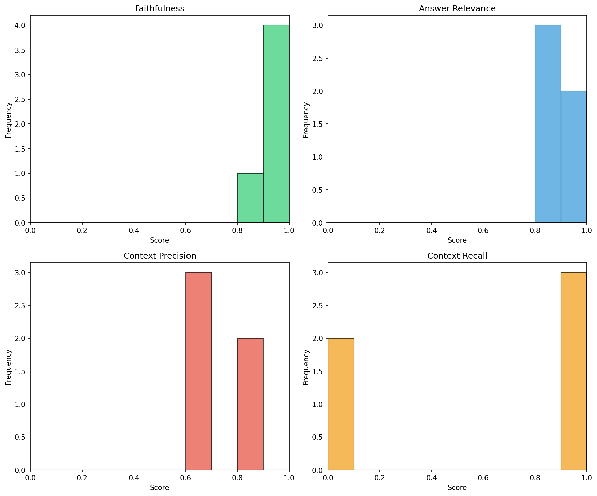

# RAG Evaluation Report

Generated: 2026-06-19 11:44:18

Total Questions Evaluated: 5

---

## Aggregate Metrics

| Metric | Mean | Min | Max | Std Dev | Valid Count |
| --- | --- | --- | --- | --- | --- |
| Faithfulness | 0.96 | 0.8 | 1.0 | 0.0894 | 5 |
| Answer Relevance | 0.86 | 0.8 | 1.0 | 0.0894 | 5 |
| Context Precision | 0.74 | 0.7 | 0.8 | 0.0548 | 5 |
| Context Recall | 0.6 | 0.0 | 1.0 | 0.5477 | 5 |

## Score Distribution

## Top 3 Best Answers (by Average Score)

### q04: Does the company's health insurance plan cover dependents, and what is the premium contribution split between employer and employee?

**Answer:** Yes, the company's health insurance plan covers spouses and dependent children. The premium contribution split is 80% employer and 20% employee, with the employee's portion deducted monthly from their payroll.

**Retrieved Chunks:** ["d01f3a3ac752ef5014732b2b1a2c368e"]

**Avg Score:** 0.9

- **Faithfulness (1.0):** The generated answer statement that the company's health insurance plan covers spouses and dependent children is directly supported by the retrieved context. Additionally, the context also supports the claim that the premium contribution split is 80% employer and 20% employee, with the employee's portion deducted monthly from their payroll. Every claim, fact, and statement in the generated answer is directly supported by the retrieved context, indicating zero hallucination.

- **Answer Relevance (0.8):** The generated answer fully addresses the question regarding the coverage of dependents and the premium contribution split between employer and employee. However, it misses the additional detail provided in the ground truth answer about dental and vision coverage being included at no additional cost, which is a minor nuance. Overall, the generated answer provides the key information requested in the question, making it a strong but not perfect response.

- **Context Precision (0.8):** The retrieved chunk contains the necessary information to answer the question about the company's health insurance plan covering dependents and the premium contribution split between employer and employee. It explicitly states that the health insurance plan covers spouses and dependent children, and that the employer contributes 80% of the premium while the employee contributes 20%. However, the chunk also includes a significant amount of irrelevant information about remote work policies, paid annual leave, maternity leave, dress code, and other benefits, which is not necessary for answering the question. This noise reduces the overall relevance and usefulness of the retrieved chunk, but the presence of the key information still makes it a valuable retrieval.

- **Context Recall (1.0):** The retrieved chunks contain all the necessary information to fully answer the question. The text explicitly states that the health insurance plan covers spouses and dependent children, and provides the premium contribution split between the employer and employee, which is 80% and 20% respectively. Although the retrieved chunk IDs do not match the ground truth chunk IDs, the content coverage is complete, as all required details are present in the retrieved chunks.

---

### q02: How many days of paid annual leave are full-time employees entitled to, and does this increase with tenure?

**Answer:** Full-time employees are entitled to 20 days of paid annual leave per year. After 3 years of continuous service, this increases to 25 days.

**Retrieved Chunks:** ["d01f3a3ac752ef5014732b2b1a2c368e"]

**Avg Score:** 0.875

- **Faithfulness (1.0):** The generated answer states that full-time employees are entitled to 20 days of paid annual leave per year, which increases to 25 days after 3 years of continuous service. Both of these claims are directly supported by the retrieved context, which explicitly mentions the same entitlements and tenure-based increase. There are no unsupported inferences, embellishments, or hallucinated details in the generated answer, making it a faithful representation of the retrieved context.

- **Answer Relevance (0.8):** The generated answer fully addresses the main components of the question, providing the number of days of paid annual leave full-time employees are entitled to and how this increases with tenure. However, it misses a minor nuance mentioned in the ground truth answer, which is the ability to carry over unused leave up to a maximum of 5 days into the next calendar year. This omission prevents the generated answer from being considered a complete and fully accurate response to the question.

- **Context Precision (0.7):** The retrieved chunk contains the necessary information to answer the question, specifically that full-time employees receive 20 days of paid annual leave per year and that this increases to 25 days after 3 years of continuous service. However, the chunk also includes a significant amount of irrelevant information, such as details about remote work, maternity leave, health insurance, dress code, and casual Fridays, which are not necessary for answering the question about paid annual leave. This noise reduces the overall relevance and usefulness of the retrieved chunk, but the presence of the correct information still makes it somewhat useful.

- **Context Recall (1.0):** The retrieved chunks contain all the necessary information to fully answer the question. The text states that full-time employees receive 20 days of paid annual leave per year and that this increases to 25 days after 3 years of continuous service, directly addressing the question. Although the retrieved chunk IDs do not match the ground truth chunk IDs, the content coverage is complete, as all required details are present in the retrieved text.

---

### q05: What is the dress code for the corporate headquarters, and are there exceptions for client-facing roles?

**Answer:** The dress code for the corporate headquarters is business-casual. However, there are exceptions for employees in client-facing roles (such as sales, consulting, and executive relations), who are required to wear formal business attire on days with external meetings. Additionally, all employees can dress casually on Fridays, wearing jeans and polo shirts.

**Retrieved Chunks:** ["d01f3a3ac752ef5014732b2b1a2c368e"]

**Avg Score:** 0.875

- **Faithfulness (0.8):** The generated answer largely sticks to the retrieved context, correctly stating the business-casual dress code for the corporate headquarters and the exception for client-facing roles. However, it slightly embellishes by implying that all employees can dress casually on Fridays without explicitly stating that this is a general rule, which is supported by the context. The core claims are directly supported, but the minor addition of 'all employees' could be seen as a minor unsupported inference, as the context only mentions 'Casual Fridays allow jeans and polo shirts' without specifying that this applies to all employees. Nonetheless, the core information about dress code and exceptions is faithfully represented.

- **Answer Relevance (0.9):** The generated answer fully addresses the question regarding the dress code for the corporate headquarters and the exceptions for client-facing roles. It also provides additional relevant information about casual Fridays, which is present in the ground truth answer. The only minor difference is in the wording and detail of the casual Friday policy, but this does not significantly impact the overall relevance of the answer to the question.

- **Context Precision (0.8):** The retrieved chunk contains relevant information about the corporate headquarters' dress code, including the business-casual dress code and exceptions for client-facing roles. However, it also includes unnecessary details about remote work policies, paid annual leave, maternity leave, and health insurance, which are not relevant to the question. The presence of this noise reduces the overall score, but the chunk still provides a direct answer to the question, making it mostly relevant and useful.

- **Context Recall (1.0):** The retrieved chunks contain all the necessary information to fully answer the question. The corporate headquarters' dress code is described as business-casual, and there are exceptions for client-facing roles, which require formal business attire on days with external meetings. Although the retrieved chunk IDs do not match the ground truth chunk IDs, the content coverage is complete, with all relevant details provided. Therefore, the retrieved content is fully sufficient to answer the question.

---

## Bottom 3 Worst Answers (by Average Score)

### q03: What is the procedure for requesting maternity leave, and how far in advance must the request be submitted?

**Answer:** The procedure for requesting maternity leave involves submitting a request at least 12 weeks before the expected due date, which must include a medical certificate and be routed through the direct manager and HR department.

**Retrieved Chunks:** ["d01f3a3ac752ef5014732b2b1a2c368e"]

**Avg Score:** 0.625

- **Faithfulness (1.0):** The generated answer directly states that the procedure for requesting maternity leave involves submitting a request at least 12 weeks before the expected due date, which must include a medical certificate and be routed through the direct manager and HR department. This information is directly supported by the retrieved context, which explicitly mentions that employees must submit a maternity leave request at least 12 weeks before the expected due date, including a medical certificate, and routing it through the direct manager and HR department. There are no unsupported claims, inferences, or embellishments in the generated answer, indicating zero hallucination and strict adherence to the retrieved context.

- **Answer Relevance (0.8):** The generated answer accurately describes the procedure for requesting maternity leave, including the timeframe and required documentation. However, it misses a key aspect of the ground truth answer, which is the duration and pay details of the standard maternity leave. This omission prevents the answer from fully addressing the question, but it still provides the essential information regarding the request procedure, thus scoring 0.8.

- **Context Precision (0.7):** The retrieved chunk contains the necessary information for answering the question about the procedure for requesting maternity leave and the required notice period. It states that employees must submit a maternity leave request at least 12 weeks before the expected due date, including a medical certificate, and route it through the direct manager and HR department. However, the chunk also includes a significant amount of irrelevant information about remote work, annual leave, health insurance, dress code, and other benefits, which is not necessary for answering the question. This noise reduces the overall relevance and usefulness of the retrieved chunk.

- **Context Recall (0.0):** The retrieved chunk IDs do not match the ground truth chunk IDs, and the content of the retrieved chunks does not contain all the necessary information to answer the question fully. The retrieved chunks provide information about remote work, annual leave, and health insurance, but they do not provide the specific procedure for requesting maternity leave or the required advance notice. The relevant information about maternity leave is present in the retrieved chunks, but the chunk IDs do not match the ground truth, indicating a failure in the retrieval step to identify the correct chunks. Therefore, the retrieved content is insufficient to fully answer the question.

**Root Cause Analysis:** The lowest score was **Context Recall** (0.0). 
The retriever missed critical chunks needed to answer the question. The corpus may lack coverage, or the embedding similarity search failed to surface the correct chunks.

---

### q01: What is the company's policy on remote work, and how many days per week are employees allowed to work from home?

**Answer:** The company's policy on remote work allows employees to work remotely up to 2 days per week, subject to manager approval and role suitability. Remote work requests must be submitted via the HR portal at least 48 hours in advance.

**Retrieved Chunks:** ["d01f3a3ac752ef5014732b2b1a2c368e"]

**Avg Score:** 0.675

- **Faithfulness (1.0):** The generated answer statement that 'The company's policy on remote work allows employees to work remotely up to 2 days per week, subject to manager approval and role suitability' is directly supported by the retrieved context. Additionally, the statement 'Remote work requests must be submitted via the HR portal at least 48 hours in advance' is also directly supported by the context. There are no unsupported claims, inferences, or embellishments in the generated answer, indicating zero hallucination and strict adherence to the retrieved context.

- **Answer Relevance (1.0):** The generated answer fully and accurately addresses every aspect of the question, including the company's policy on remote work and the number of days per week employees are allowed to work from home, as well as the conditions and procedures for remote work requests, which matches the ground truth answer.

- **Context Precision (0.7):** The retrieved chunk contains the relevant information that employees may work remotely up to 2 days per week, subject to manager approval and role suitability, which directly answers the question about the company's policy on remote work. However, the chunk also includes a significant amount of noise, such as details about paid annual leave, maternity leave, health insurance, dress code, and other unrelated policies, which are not necessary for answering the question. Despite the presence of this noise, the chunk does provide the necessary information to answer the question, making it mostly relevant but not entirely precise.

- **Context Recall (0.0):** The retrieved chunk IDs do not match the ground truth chunk IDs, and the content of the retrieved chunks does not fully cover the information necessary to answer the question. The retrieved chunks provide some information about remote work, such as the number of days per week allowed, but they do not address the company's overall policy on remote work. Additionally, the retrieved chunks contain a lot of irrelevant information about other HR policies, such as paid annual leave, maternity leave, health insurance, and dress code. The lack of relevant information and the presence of irrelevant information suggest that the retrieval step failed to surface the necessary chunks to fully answer the question.

**Root Cause Analysis:** The lowest score was **Context Recall** (0.0). 
The retriever missed critical chunks needed to answer the question. The corpus may lack coverage, or the embedding similarity search failed to surface the correct chunks.

---

### q02: How many days of paid annual leave are full-time employees entitled to, and does this increase with tenure?

**Answer:** Full-time employees are entitled to 20 days of paid annual leave per year. After 3 years of continuous service, this increases to 25 days.

**Retrieved Chunks:** ["d01f3a3ac752ef5014732b2b1a2c368e"]

**Avg Score:** 0.875

- **Faithfulness (1.0):** The generated answer states that full-time employees are entitled to 20 days of paid annual leave per year, which increases to 25 days after 3 years of continuous service. Both of these claims are directly supported by the retrieved context, which explicitly mentions the same entitlements and tenure-based increase. There are no unsupported inferences, embellishments, or hallucinated details in the generated answer, making it a faithful representation of the retrieved context.

- **Answer Relevance (0.8):** The generated answer fully addresses the main components of the question, providing the number of days of paid annual leave full-time employees are entitled to and how this increases with tenure. However, it misses a minor nuance mentioned in the ground truth answer, which is the ability to carry over unused leave up to a maximum of 5 days into the next calendar year. This omission prevents the generated answer from being considered a complete and fully accurate response to the question.

- **Context Precision (0.7):** The retrieved chunk contains the necessary information to answer the question, specifically that full-time employees receive 20 days of paid annual leave per year and that this increases to 25 days after 3 years of continuous service. However, the chunk also includes a significant amount of irrelevant information, such as details about remote work, maternity leave, health insurance, dress code, and casual Fridays, which are not necessary for answering the question about paid annual leave. This noise reduces the overall relevance and usefulness of the retrieved chunk, but the presence of the correct information still makes it somewhat useful.

- **Context Recall (1.0):** The retrieved chunks contain all the necessary information to fully answer the question. The text states that full-time employees receive 20 days of paid annual leave per year and that this increases to 25 days after 3 years of continuous service, directly addressing the question. Although the retrieved chunk IDs do not match the ground truth chunk IDs, the content coverage is complete, as all required details are present in the retrieved text.

**Root Cause Analysis:** The lowest score was **Context Precision** (0.7). 
The retriever returned noisy or irrelevant chunks. Consider tuning the embedding model, adjusting top_k, or filtering chunks by similarity threshold.

---

## Prioritized Improvement Roadmap

Based on aggregate metric scores, ranked from lowest-performing to highest:

1. **Context Recall** (Mean: 0.6) — 
Increase top_k or implement hybrid search (dense + keyword). Audit the corpus for coverage gaps and add missing documents.

2. **Context Precision** (Mean: 0.74) — 
Implement a similarity threshold filter to drop low-relevance chunks. Consider re-ranking retrieved chunks with a cross-encoder before passing to the generator.

3. **Answer Relevance** (Mean: 0.86) — 
Improve query understanding by adding query rewriting or expansion. Ensure the generator is explicitly instructed to answer the exact question asked.

4. **Faithfulness** (Mean: 0.96) — 
Strengthen the generator system prompt with stricter grounding instructions. Add a post-generation fact-checking layer against retrieved chunks.
