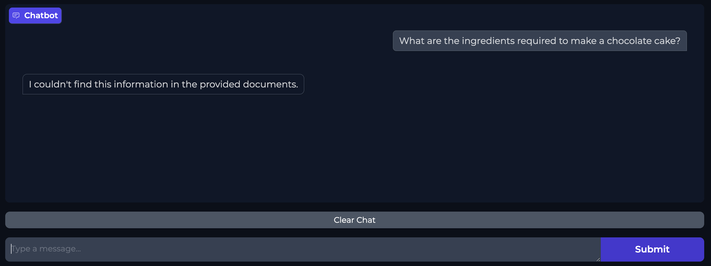
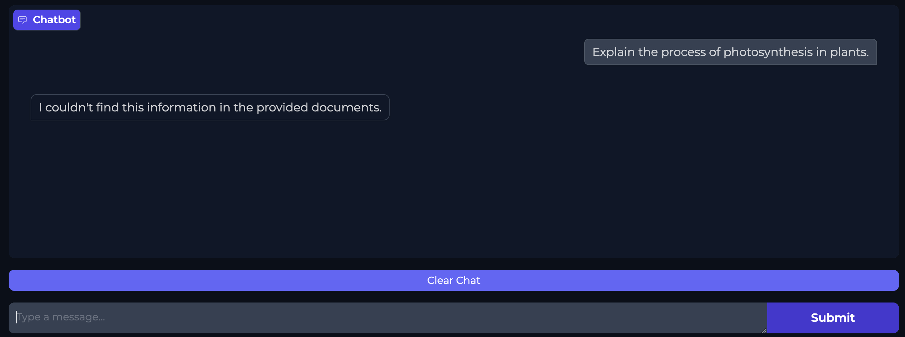

# guide.md — Grounded RAG Chatbot with Inline Citations

> **⚠️ ARCHITECTURAL ASSUMPTIONS DISCLAIMER**
>
> The original project specification referenced **Google Vertex AI Vector Search** as the vector store and **Gemini** as the LLM. Both have been replaced in this implementation:
>
> | Original Spec | This Implementation | Reason |
> |---|---|---|
> | Google Vertex AI Vector Search | FAISS (local, file-based) | No cloud credentials required; zero cost; fully portable; ideal for intern workflow |
> | Gemini (Google AI) | Groq API — `llama-3.3-70b-versatile` | Aligns with intern's existing Groq API workflow; significantly lower latency; free tier available |
> | Any OpenAI Embeddings | `sentence-transformers` (`all-MiniLM-L6-v2`) | Free, local, no API key needed for embeddings; production-quality semantic search |
>
> All other aspects of the project (RAG pipeline, citation enforcement, hallucination prevention, Gradio UI) are implemented as specified. Python 3.10+ is assumed throughout. The virtual environment is named `myenv`.

---

## Table of Contents

1. [Section 1: Project Architecture & Overview](#section-1-project-architecture--overview)
2. [Section 2: Repository & Folder Structure](#section-2-repository--folder-structure)
3. [Section 3: Production-Ready Implementation Code](#section-3-production-ready-implementation-code)
4. [Section 4: Code Logic & Deep-Dive](#section-4-code-logic--deep-dive)
5. [Section 5: Deployment & Execution Guide](#section-5-deployment--execution-guide)
6. [Section 6: Intern Viva & Code Review Questions](#section-6-intern-viva--code-review-questions)

---

## Section 1: Project Architecture & Overview

### 1.1 What This System Does

This project implements a **Retrieval-Augmented Generation (RAG)** chatbot. RAG is an architecture that solves a fundamental LLM limitation: large language models are trained on static data and cannot "know" information from your private documents. More dangerously, they will often *hallucinate* — confidently fabricating answers that sound plausible but are entirely false.

This system prevents hallucination at two levels:
1. **Architectural level:** The LLM is only ever shown the top-5 most relevant chunks from your documents. It cannot access its training knowledge to fill gaps.
2. **Prompt engineering level:** The system prompt contains explicit, numbered rules forbidding any answer not directly supported by the provided chunks, and mandating a specific fallback phrase when the chunks are insufficient.

### 1.2 The Full RAG Pipeline — Detailed Explanation

The pipeline has two distinct phases: **Ingestion** (run once) and **Query** (run on every user question).

#### Phase 1: Ingestion (run via `ingest.py`)

**Step 1 — Document Loading:**
LangChain's `PyPDFLoader` and `TextLoader` scan the `data/` directory. Each document is loaded with metadata: the filename (used as `doc_id`) and the page number. This metadata is critical — it becomes the citation `[doc_id:page]` that appears in the final answer.

**Step 2 — Chunking:**
Raw documents are too large to fit in a prompt. `RecursiveCharacterTextSplitter` breaks each document into overlapping chunks of 500 characters with a 50-character overlap. The overlap ensures that a concept split across a chunk boundary is still retrievable — the tail of chunk N and the head of chunk N+1 both contain the bridging text.

**Step 3 — Embedding:**
Each chunk is converted into a dense numerical vector (an embedding) using the `sentence-transformers` model `all-MiniLM-L6-v2`. This model maps semantically similar text to nearby points in a 384-dimensional vector space. "What is the boiling point of water?" and "At what temperature does water vaporize?" will produce very similar vectors even though no words match.

**Step 4 — FAISS Index Construction:**
All chunk embeddings are loaded into a FAISS `IndexFlatL2` index. FAISS stores these as a matrix of float32 vectors and supports extremely fast nearest-neighbor search using L2 (Euclidean) distance. The index and the chunk texts + metadata are saved to `faiss_index/` so they don't need to be rebuilt on every app launch.

#### Phase 2: Query (run on every user message in `app.py`)

**Step 5 — Query Embedding:**
The user's question is embedded using the *exact same* `all-MiniLM-L6-v2` model. This is non-negotiable: using a different model would place the query in a completely different vector space, making retrieval meaningless.

**Step 6 — FAISS Similarity Search:**
The query vector is compared against all stored chunk vectors. FAISS returns the 5 chunks with the smallest L2 distance (i.e., the most semantically similar chunks). Each result includes the chunk's index, which maps back to the stored text and metadata.

**Step 7 — Context Block Construction:**
The 5 retrieved chunks are formatted into a numbered context block. Each chunk is prefixed with its `[doc_id:page]` label. This formatted block is injected into the LLM prompt.

**Step 8 — Groq API Call with Grounding Prompt:**
The Groq API receives a payload with two messages: a system message (the grounding rules) and a user message (the context block + the original question). The model is explicitly forbidden from using any knowledge outside the provided chunks.

**Step 9 — Response Parsing and Display:**
The LLM response — which must contain inline citations like `[climate_report:3]` — is returned to the Gradio `chat()` function and displayed in the chat interface.

### 1.3 ASCII Pipeline Diagram

```
╔══════════════════════════════════════════════════════════════════════╗
║                    INGESTION PHASE (run once)                        ║
╚══════════════════════════════════════════════════════════════════════╝

  data/
  ├── report.pdf       ──┐
  ├── manual.txt       ──┤──▶  LangChain Loaders  ──▶  Raw Documents
  └── notes.pdf        ──┘     (PyPDFLoader,             + Metadata
                                TextLoader)              (doc_id, page)
                                    │
                                    ▼
                         RecursiveCharacterTextSplitter
                         (chunk_size=500, overlap=50)
                                    │
                                    ▼
                         [ chunk_0 ][ chunk_1 ][ chunk_2 ] ... [ chunk_N ]
                                    │
                                    ▼
                         sentence-transformers
                         (all-MiniLM-L6-v2)
                                    │
                                    ▼
                         [ vec_0 ][ vec_1 ][ vec_2 ] ... [ vec_N ]
                                    │
                                    ▼
                         FAISS IndexFlatL2.add(vectors)
                                    │
                                    ▼
                         faiss_index/
                         ├── index.faiss    (binary vector store)
                         └── chunks.pkl     (text + metadata)


╔══════════════════════════════════════════════════════════════════════╗
║                    QUERY PHASE (every user message)                  ║
╚══════════════════════════════════════════════════════════════════════╝

  User types: "What are the safety requirements for X?"
                                    │
                                    ▼
                         sentence-transformers
                         (all-MiniLM-L6-v2)
                                    │
                                    ▼
                         query_vector  [384-dim float32]
                                    │
                                    ▼
                         FAISS IndexFlatL2.search(query_vector, k=5)
                                    │
                                    ▼
                    ┌───────────────────────────────────┐
                    │  Top-5 Chunks (by L2 distance)    │
                    │  ┌──────────────────────────────┐ │
                    │  │ [manual:4] "Safety req..."   │ │
                    │  │ [report:12] "Operators..."   │ │
                    │  │ [notes:1] "Requirements..."  │ │
                    │  │ [manual:5] "In addition..."  │ │
                    │  │ [report:11] "Section 3.2..." │ │
                    │  └──────────────────────────────┘ │
                    └───────────────────────────────────┘
                                    │
                                    ▼
                         build_context_block()
                         (formats chunks with [doc_id:page] labels)
                                    │
                                    ▼
                    ┌───────────────────────────────────┐
                    │  GROQ API PAYLOAD                 │
                    │  system: <grounding rules>        │
                    │  user:   CONTEXT: [chunk 1]...    │
                    │          [chunk 5]                │
                    │          QUESTION: "What are..."  │
                    └───────────────────────────────────┘
                                    │
                                    ▼
                         Groq API → llama-3.3-70b-versatile
                                    │
                                    ▼
                    "Safety requirements include [manual:4]
                     proper PPE and [report:12] regular
                     equipment inspections."
                                    │
                                    ▼
                         Gradio ChatInterface  ──▶  User sees cited answer
```

### 1.4 Library Choice Rationale

#### Why FAISS over Chroma or Pinecone?

**Chroma** is excellent for persistent, queryable vector stores with metadata filtering, but it runs a background server process and has more dependencies. For an intern project where the corpus is static and fits in RAM, Chroma's extra complexity is unwarranted.

**Pinecone** is a managed cloud vector database. It requires API keys, has usage limits on the free tier, incurs latency from network round-trips, and adds a hard external dependency. If Pinecone has an outage, the chatbot dies. FAISS runs entirely in-process.

**FAISS (Facebook AI Similarity Search)** is a battle-tested C++ library with Python bindings. For a corpus of fewer than 1 million vectors, `IndexFlatL2` performs an exhaustive exact search in milliseconds. It has zero cloud dependencies, zero cost, and its index is a single binary file that can be committed to version control (or excluded, per preference). For this intern project, FAISS is the correct choice: simple, fast, free, and local.

#### Why `sentence-transformers` over OpenAI Embeddings?

**OpenAI `text-embedding-ada-002`** produces excellent 1536-dimensional embeddings but costs money per token, requires an API key, introduces network latency on every query, and creates a runtime dependency on OpenAI's API availability.

**`sentence-transformers` (`all-MiniLM-L6-v2`)** produces 384-dimensional embeddings that run entirely locally on CPU. Despite being smaller, it achieves competitive performance on semantic search benchmarks (MTEB). The model downloads once (~80MB) and runs in under 100ms per query on a laptop CPU. For intern-scale document corpora (dozens to hundreds of documents), it provides more than sufficient retrieval quality at zero ongoing cost.

#### Why Groq's `llama-3.3-70b-versatile` over GPT-4 or Gemini?

**GPT-4** (OpenAI) is expensive ($10–30 per 1M tokens), has rate limits, and requires an OpenAI API key the intern may not have.

**Gemini** (Google) requires Google Cloud credentials, which the original spec assumed but which have been identified as a portability barrier. Gemini Flash is fast but its context window handling and instruction-following for strict citation rules has shown more variance.

**Groq's `llama-3.3-70b-versatile`** runs on Groq's custom LPU (Language Processing Unit) hardware, achieving generation speeds of 200–400 tokens/second — 5–10x faster than comparable GPU-hosted models. The free tier is generous (14,400 requests/day as of early 2025). LLaMA 3.3 70B has demonstrated strong instruction-following, critical for the strict grounding rules in this system's system prompt. The intern already has a Groq API key, making this the zero-friction choice.

#### Why Gradio over Streamlit for rapid chatbot prototyping?

**Streamlit** requires managing session state manually (`st.session_state`), and building a multi-turn chat interface requires significant boilerplate. It also reruns the entire script on every interaction, which can cause issues with resource-heavy initializations (like loading a FAISS index).

**Gradio** provides `gr.ChatInterface` — a purpose-built component that handles conversation history, message rendering, streaming, and `share=True` public URL generation out of the box. The entire chat UI in this project is ~20 lines of code because Gradio absorbs all the complexity. For rapid chatbot prototyping, it is the superior choice.

---

## Section 2: Repository & Folder Structure

### 2.1 Complete Project Tree

```
rag_bot/
├── data/                         # Raw documents (PDFs, TXTs) — intern populates this
│   ├── document1.pdf             # (example — add your own files here)
│   └── notes.txt                 # (example)
│
├── faiss_index/                  # Persisted FAISS index files (auto-generated by ingest.py)
│   ├── index.faiss               # Binary FAISS index (vector matrix)
│   └── chunks.pkl                # Python pickle: list of {text, doc_id, page} dicts
│
├── screenshots/                  # Deliverable screenshots for submission
│   ├── citation_01.png           # (placeholder — intern fills these in)
│   ├── citation_02.png
│   ├── citation_03.png
│   ├── citation_04.png
│   ├── citation_05.png
│   ├── no_answer_01.png
│   ├── no_answer_02.png
│   ├── no_answer_03.png
│   ├── no_answer_04.png
│   └── no_answer_05.png
│
├── logs/
│   └── output.log                # All runtime logs appended here (auto-created)
│
├── src/
│   ├── __init__.py               # Makes src a Python package
│   ├── retriever.py              # FAISS index loader + top-k chunk retriever
│   ├── generator.py              # Groq API caller with grounding prompt
│   └── logger_config.py          # Centralized logging setup (dual console + file)
│
├── app.py                        # Gradio chat UI entry point
├── ingest.py                     # One-time ingestion script: load → chunk → embed → save
├── system_prompt.md              # Human-readable grounding prompt specification
├── no_answer_demo.md             # 5 out-of-corpus questions + expected bot responses
├── requirements.txt              # All pinned dependencies
├── .env                          # GROQ_API_KEY stored here — NEVER commit this file
├── .gitignore                    # Excludes .env, myenv/, faiss_index/, logs/
└── guide.md                      # This document
```

### 2.2 Complete Bash Scaffold Script

Save the following as `setup.sh` and run `bash setup.sh` from the directory *above* `rag_bot/`. It creates the full directory structure, virtual environment, and installs all dependencies in a single execution.

```bash
#!/usr/bin/env bash
# =============================================================================
# setup.sh — Full project scaffold for Grounded RAG Chatbot
# Run this from the PARENT directory of where you want rag_bot/ to live.
# Usage: bash setup.sh
# =============================================================================

set -e  # Exit immediately on any error

echo "=============================================="
echo "  Grounded RAG Chatbot — Project Scaffold"
echo "=============================================="

# --- Step 1: Create directory structure ---
echo "[1/6] Creating project directory structure..."

mkdir -p rag_bot/data
mkdir -p rag_bot/faiss_index
mkdir -p rag_bot/screenshots
mkdir -p rag_bot/logs
mkdir -p rag_bot/src

# Create placeholder files so git tracks empty directories
touch rag_bot/data/.gitkeep
touch rag_bot/faiss_index/.gitkeep
touch rag_bot/screenshots/.gitkeep
touch rag_bot/logs/.gitkeep

# Create all source files as empty placeholders
touch rag_bot/src/__init__.py
touch rag_bot/src/logger_config.py
touch rag_bot/src/retriever.py
touch rag_bot/src/generator.py
touch rag_bot/app.py
touch rag_bot/ingest.py
touch rag_bot/system_prompt.md
touch rag_bot/no_answer_demo.md
touch rag_bot/guide.md

echo "    ✓ Directory structure created."

# --- Step 2: Create requirements.txt ---
echo "[2/6] Writing requirements.txt..."

cat > rag_bot/requirements.txt << 'EOF'
groq==0.9.0
faiss-cpu==1.8.0
sentence-transformers==3.0.1
langchain==0.2.14
langchain-community==0.2.12
pypdf==4.3.1
gradio==4.42.0
python-dotenv==1.0.1
numpy==1.26.4
EOF

echo "    ✓ requirements.txt written."

# --- Step 3: Create .env template ---
echo "[3/6] Writing .env template..."

cat > rag_bot/.env << 'EOF'
GROQ_API_KEY=your_groq_api_key_here
EOF

echo "    ✓ .env template created. IMPORTANT: Add your real Groq API key before running."

# --- Step 4: Create .gitignore ---
echo "[4/6] Writing .gitignore..."

cat > rag_bot/.gitignore << 'EOF'
# Environment
.env
myenv/
__pycache__/
*.pyc
*.pyo
.DS_Store

# Generated artifacts
faiss_index/
logs/

# Python packaging
*.egg-info/
dist/
build/
EOF

echo "    ✓ .gitignore created."

# --- Step 5: Create virtual environment ---
echo "[5/6] Creating Python virtual environment 'myenv'..."

cd rag_bot
python3 -m venv myenv
echo "    ✓ Virtual environment 'myenv' created."

# --- Step 6: Activate and install dependencies ---
echo "[6/6] Installing dependencies into myenv..."

# Activate the virtual environment
source myenv/bin/activate

pip install --upgrade pip --quiet
pip install -r requirements.txt

echo ""
echo "=============================================="
echo "  ✓ Scaffold complete!"
echo "=============================================="
echo ""
echo "  NEXT STEPS:"
echo "  1. cd rag_bot"
echo "  2. source myenv/bin/activate          (Linux/Mac)"
echo "     OR: myenv\\Scripts\\activate.bat    (Windows)"
echo "  3. Edit .env and add your real GROQ_API_KEY"
echo "  4. Add PDF or TXT files to the data/ directory"
echo "  5. python ingest.py"
echo "  6. python app.py"
echo "=============================================="
```

---

## Section 3: Production-Ready Implementation Code

### 3.1 — `src/logger_config.py`

```python
"""
src/logger_config.py
--------------------
Centralized logging configuration for the Grounded RAG Chatbot.

Provides a get_logger(name) factory that returns a logger which simultaneously:
  - Prints to stdout (StreamHandler)
  - Appends to logs/output.log (FileHandler)

Log format: TIMESTAMP | LEVEL | MODULE | MESSAGE
Example:    2025-01-15 14:32:01 | INFO | retriever | Loaded FAISS index with 1,204 vectors
"""

import logging
from pathlib import Path


# --- Constants ---
LOG_DIR = Path(__file__).resolve().parent.parent / "logs"
LOG_FILE = LOG_DIR / "output.log"
LOG_FORMAT = "%(asctime)s | %(levelname)-8s | %(name)s | %(message)s"
DATE_FORMAT = "%Y-%m-%d %H:%M:%S"

# Track which loggers have already been configured to avoid duplicate handlers
_configured_loggers: set[str] = set()


def get_logger(name: str) -> logging.Logger:
    """
    Returns a configured logger that writes to both console and logs/output.log.

    Args:
        name: The logger name — typically the module name (e.g., 'retriever',
              'generator', 'ingest'). Use __name__ from the calling module.

    Returns:
        A logging.Logger instance with StreamHandler and FileHandler attached.

    Example:
        from src.logger_config import get_logger
        logger = get_logger(__name__)
        logger.info("FAISS index loaded successfully.")
    """
    # Ensure the logs directory exists before trying to write to it
    LOG_DIR.mkdir(parents=True, exist_ok=True)

    logger = logging.getLogger(name)

    # Prevent duplicate handlers if get_logger is called multiple times
    # for the same name (common in module-level calls during reloads)
    if name in _configured_loggers:
        return logger

    logger.setLevel(logging.DEBUG)

    formatter = logging.Formatter(fmt=LOG_FORMAT, datefmt=DATE_FORMAT)

    # --- Console Handler (stdout) ---
    stream_handler = logging.StreamHandler()
    stream_handler.setLevel(logging.DEBUG)
    stream_handler.setFormatter(formatter)

    # --- File Handler (logs/output.log) ---
    file_handler = logging.FileHandler(LOG_FILE, mode="a", encoding="utf-8")
    file_handler.setLevel(logging.DEBUG)
    file_handler.setFormatter(formatter)

    logger.addHandler(stream_handler)
    logger.addHandler(file_handler)

    # Prevent log messages from propagating to the root logger
    # (avoids duplicate output if root logger is configured elsewhere)
    logger.propagate = False

    _configured_loggers.add(name)

    return logger
```

---

### 3.2 — `requirements.txt`

```
groq==0.9.0
faiss-cpu==1.8.0
sentence-transformers==3.0.1
langchain==0.2.14
langchain-community==0.2.12
pypdf==4.3.1
gradio==4.42.0
python-dotenv==1.0.1
numpy==1.26.4
```

> **Version Notes:**
> - `faiss-cpu==1.8.0` — Use the CPU variant; `faiss-gpu` requires CUDA setup which is out of scope here.
> - `langchain==0.2.14` + `langchain-community==0.2.12` — These versions must be paired; community is a companion package to the core langchain package.
> - `pypdf==4.3.1` — Required by LangChain's `PyPDFLoader`. Do NOT use the deprecated `PyPDF2`.
> - `numpy==1.26.4` — FAISS and sentence-transformers require numpy < 2.0 for binary compatibility.
> - `gradio==4.42.0` — Use 4.x; Gradio 5.x introduced breaking API changes to `ChatInterface`.

---

### 3.3 — `.env` (Template)

```
GROQ_API_KEY=your_groq_api_key_here
```

> **Security note:** This file must NEVER be committed to version control. It is listed in `.gitignore`. Obtain your Groq API key at https://console.groq.com/keys.

---

### 3.4 — `ingest.py`

```python
"""
ingest.py
---------
One-time document ingestion pipeline for the Grounded RAG Chatbot.

This script:
  1. Scans data/ for .pdf and .txt files
  2. Loads each file with appropriate LangChain loaders
  3. Chunks documents using RecursiveCharacterTextSplitter
  4. Embeds all chunks using sentence-transformers (all-MiniLM-L6-v2)
  5. Builds a FAISS IndexFlatL2 and saves it to faiss_index/

Run once before launching app.py:
  python ingest.py

Graceful degradation:
  - Empty data/ directory: logs WARNING and exits cleanly.
  - Unsupported file types: logs WARNING and skips the file.
  - Embedding failures: logs ERROR, skips that chunk, continues.
"""

import os
import sys
import time
import pickle
from pathlib import Path

import numpy as np
import faiss
from sentence_transformers import SentenceTransformer
from langchain_community.document_loaders import PyPDFLoader, TextLoader
from langchain.text_splitter import RecursiveCharacterTextSplitter

from src.logger_config import get_logger

# --- Configuration ---
logger = get_logger("ingest")

BASE_DIR = Path(__file__).resolve().parent
DATA_DIR = BASE_DIR / "data"
INDEX_DIR = BASE_DIR / "faiss_index"
INDEX_FILE = INDEX_DIR / "index.faiss"
CHUNKS_FILE = INDEX_DIR / "chunks.pkl"

EMBEDDING_MODEL_NAME = "all-MiniLM-L6-v2"
CHUNK_SIZE = 500
CHUNK_OVERLAP = 50
SUPPORTED_EXTENSIONS = {".pdf", ".txt"}


def load_documents(data_dir: Path) -> list[dict]:
    """
    Scan data_dir for supported files and load them using LangChain loaders.

    Returns:
        A list of dicts with keys: 'text' (str), 'doc_id' (str), 'page' (int).
        Returns an empty list if no supported files are found.
    """
    logger.info(f"Scanning '{data_dir}' for documents...")

    # Check if data directory exists
    if not data_dir.exists():
        logger.warning(f"Data directory '{data_dir}' does not exist. Creating it now.")
        data_dir.mkdir(parents=True, exist_ok=True)

    # Find all files
    all_files = list(data_dir.iterdir())
    supported_files = [f for f in all_files if f.suffix.lower() in SUPPORTED_EXTENSIONS]
    unsupported_files = [f for f in all_files if f.is_file() and f.suffix.lower() not in SUPPORTED_EXTENSIONS and not f.name.startswith(".")]

    if unsupported_files:
        for f in unsupported_files:
            logger.warning(f"Unsupported file type, skipping: '{f.name}' (extension '{f.suffix}')")

    if not supported_files:
        logger.warning(
            f"No supported files (.pdf, .txt) found in '{data_dir}'. "
            "Please add documents before running ingest.py."
        )
        return []

    logger.info(f"Found {len(supported_files)} supported file(s): {[f.name for f in supported_files]}")

    raw_documents = []

    for file_path in supported_files:
        doc_id = file_path.stem  # filename without extension, used as citation ID
        logger.info(f"Loading '{file_path.name}' (doc_id='{doc_id}')...")

        try:
            if file_path.suffix.lower() == ".pdf":
                loader = PyPDFLoader(str(file_path))
                pages = loader.load()
                for page_doc in pages:
                    raw_documents.append({
                        "text": page_doc.page_content,
                        "doc_id": doc_id,
                        "page": page_doc.metadata.get("page", 0) + 1  # 0-indexed → 1-indexed
                    })
                logger.info(f"  → Loaded {len(pages)} page(s) from '{file_path.name}'")

            elif file_path.suffix.lower() == ".txt":
                loader = TextLoader(str(file_path), encoding="utf-8")
                docs = loader.load()
                for i, doc in enumerate(docs):
                    raw_documents.append({
                        "text": doc.page_content,
                        "doc_id": doc_id,
                        "page": i + 1
                    })
                logger.info(f"  → Loaded {len(docs)} section(s) from '{file_path.name}'")

        except Exception as e:
            logger.error(f"Failed to load '{file_path.name}': {e}. Skipping this file.")
            continue

    logger.info(f"Total raw document sections loaded: {len(raw_documents)}")
    return raw_documents


def chunk_documents(raw_documents: list[dict]) -> list[dict]:
    """
    Split raw document sections into overlapping chunks.

    Each input dict has 'text', 'doc_id', 'page'.
    Each output dict has 'text' (the chunk text), 'doc_id', 'page'.

    Returns:
        A list of chunk dicts ready for embedding.
    """
    logger.info(f"Chunking {len(raw_documents)} document sections "
                f"(chunk_size={CHUNK_SIZE}, chunk_overlap={CHUNK_OVERLAP})...")

    splitter = RecursiveCharacterTextSplitter(
        chunk_size=CHUNK_SIZE,
        chunk_overlap=CHUNK_OVERLAP,
        length_function=len,
        separators=["\n\n", "\n", ". ", " ", ""]
    )

    all_chunks = []

    for doc in raw_documents:
        if not doc["text"].strip():
            logger.debug(f"Skipping empty section from doc_id='{doc['doc_id']}', page={doc['page']}")
            continue

        try:
            sub_chunks = splitter.split_text(doc["text"])
            for chunk_text in sub_chunks:
                if chunk_text.strip():  # Skip any whitespace-only chunks
                    all_chunks.append({
                        "text": chunk_text.strip(),
                        "doc_id": doc["doc_id"],
                        "page": doc["page"]
                    })
        except Exception as e:
            logger.error(f"Failed to chunk doc_id='{doc['doc_id']}', page={doc['page']}: {e}. Skipping.")
            continue

    logger.info(f"Total chunks created: {len(all_chunks)}")
    return all_chunks


def embed_chunks(chunks: list[dict], model: SentenceTransformer) -> np.ndarray:
    """
    Embed all chunk texts using the provided SentenceTransformer model.

    Args:
        chunks: List of chunk dicts with 'text' key.
        model: Loaded SentenceTransformer model.

    Returns:
        A numpy array of shape (len(chunks), embedding_dim) as float32.
        Chunks that fail to embed are assigned a zero vector and logged as errors.
    """
    logger.info(f"Embedding {len(chunks)} chunks using '{EMBEDDING_MODEL_NAME}'...")
    start_time = time.time()

    texts = [chunk["text"] for chunk in chunks]

    try:
        # batch_size=32 is a safe default for CPU inference
        embeddings = model.encode(
            texts,
            batch_size=32,
            show_progress_bar=True,
            convert_to_numpy=True,
            normalize_embeddings=False  # FAISS IndexFlatL2 does not require normalized vectors
        )
        embeddings = embeddings.astype(np.float32)
    except Exception as e:
        logger.error(f"Batch embedding failed: {e}. Attempting chunk-by-chunk fallback...")
        embedding_dim = model.get_sentence_embedding_dimension()
        embeddings = np.zeros((len(chunks), embedding_dim), dtype=np.float32)

        for i, text in enumerate(texts):
            try:
                vec = model.encode([text], convert_to_numpy=True).astype(np.float32)
                embeddings[i] = vec[0]
            except Exception as inner_e:
                logger.error(
                    f"Failed to embed chunk {i} (doc_id='{chunks[i]['doc_id']}', "
                    f"page={chunks[i]['page']}): {inner_e}. Using zero vector."
                )
                # Zero vector stays in place — this chunk will not be retrieved correctly
                # but it won't crash the pipeline

    elapsed = time.time() - start_time
    logger.info(f"Embedding complete. Time elapsed: {elapsed:.2f}s. "
                f"Embedding shape: {embeddings.shape}")
    return embeddings


def build_and_save_faiss_index(embeddings: np.ndarray, chunks: list[dict]) -> None:
    """
    Build a FAISS IndexFlatL2 from embeddings and save index + chunk metadata to disk.

    Args:
        embeddings: numpy array of shape (N, D) as float32.
        chunks: List of chunk dicts (parallel array to embeddings).
    """
    logger.info("Building FAISS IndexFlatL2...")

    embedding_dim = embeddings.shape[1]
    index = faiss.IndexFlatL2(embedding_dim)
    index.add(embeddings)

    logger.info(f"FAISS index built. Total vectors: {index.ntotal}, Dimension: {embedding_dim}")

    # Ensure output directory exists
    INDEX_DIR.mkdir(parents=True, exist_ok=True)

    # Save binary FAISS index
    faiss.write_index(index, str(INDEX_FILE))
    logger.info(f"FAISS index saved to '{INDEX_FILE}'")

    # Save chunk metadata (text + doc_id + page) as a pickle file
    with open(CHUNKS_FILE, "wb") as f:
        pickle.dump(chunks, f)
    logger.info(f"Chunk metadata saved to '{CHUNKS_FILE}' ({len(chunks)} entries)")


def main() -> None:
    """
    Main ingestion pipeline. Orchestrates: load → chunk → embed → save.
    Exits cleanly with a log message if data/ is empty.
    """
    logger.info("=" * 60)
    logger.info("Starting document ingestion pipeline")
    logger.info("=" * 60)

    # Step 1: Load documents
    raw_documents = load_documents(DATA_DIR)

    if not raw_documents:
        logger.warning(
            "No documents were loaded. Ingestion pipeline aborted. "
            "Please add .pdf or .txt files to the data/ directory and re-run."
        )
        sys.exit(0)

    # Step 2: Chunk documents
    chunks = chunk_documents(raw_documents)

    if not chunks:
        logger.warning("No chunks were produced from the loaded documents. Aborting.")
        sys.exit(0)

    # Step 3: Load embedding model
    logger.info(f"Loading embedding model '{EMBEDDING_MODEL_NAME}'...")
    try:
        model = SentenceTransformer(EMBEDDING_MODEL_NAME)
        logger.info(f"Model loaded. Embedding dimension: {model.get_sentence_embedding_dimension()}")
    except Exception as e:
        logger.error(f"Failed to load embedding model: {e}")
        sys.exit(1)

    # Step 4: Embed chunks
    embeddings = embed_chunks(chunks, model)

    # Step 5: Build and save FAISS index
    build_and_save_faiss_index(embeddings, chunks)

    logger.info("=" * 60)
    logger.info("Ingestion pipeline complete. You may now run: python app.py")
    logger.info("=" * 60)


if __name__ == "__main__":
    main()
```

---

### 3.5 — `src/retriever.py`

```python
"""
src/retriever.py
----------------
FAISS index loader and semantic retriever for the Grounded RAG Chatbot.

Provides two public functions:
  - load_index(): Loads the FAISS index and chunk metadata from disk.
  - retrieve(query, top_k): Embeds a query and returns the top-k most
    semantically similar chunks with their metadata and L2 scores.

Graceful degradation:
  - If the FAISS index is not found, load_index() logs an ERROR and
    returns (None, None) without raising an exception.
  - retrieve() checks for a None index and returns an empty list safely.
"""

import time
import pickle
from pathlib import Path

import numpy as np
import faiss
from sentence_transformers import SentenceTransformer

from src.logger_config import get_logger

# --- Configuration ---
logger = get_logger("retriever")

BASE_DIR = Path(__file__).resolve().parent.parent
INDEX_DIR = BASE_DIR / "faiss_index"
INDEX_FILE = INDEX_DIR / "index.faiss"
CHUNKS_FILE = INDEX_DIR / "chunks.pkl"

EMBEDDING_MODEL_NAME = "all-MiniLM-L6-v2"

# Module-level state: loaded once at startup, reused for all queries
_index: faiss.Index | None = None
_chunks: list[dict] | None = None
_model: SentenceTransformer | None = None


def load_index() -> tuple[faiss.Index | None, list[dict] | None]:
    """
    Load the FAISS index and chunk metadata from disk.

    Sets module-level _index, _chunks, and _model for reuse.

    Returns:
        Tuple of (faiss.Index, list[dict]) on success.
        Tuple of (None, None) on failure — caller must handle gracefully.
    """
    global _index, _chunks, _model

    logger.info("Loading FAISS index and chunk metadata...")

    # --- Check for index files ---
    if not INDEX_FILE.exists():
        logger.error(
            f"FAISS index file not found at '{INDEX_FILE}'. "
            "Please run 'python ingest.py' first."
        )
        return None, None

    if not CHUNKS_FILE.exists():
        logger.error(
            f"Chunk metadata file not found at '{CHUNKS_FILE}'. "
            "Please run 'python ingest.py' first."
        )
        return None, None

    # --- Load FAISS index ---
    try:
        _index = faiss.read_index(str(INDEX_FILE))
        logger.info(
            f"FAISS index loaded. Total vectors: {_index.ntotal:,}, "
            f"Dimension: {_index.d}"
        )
    except Exception as e:
        logger.error(f"Failed to load FAISS index: {e}")
        return None, None

    # --- Load chunk metadata ---
    try:
        with open(CHUNKS_FILE, "rb") as f:
            _chunks = pickle.load(f)
        logger.info(f"Chunk metadata loaded. Total chunks: {len(_chunks):,}")
    except Exception as e:
        logger.error(f"Failed to load chunk metadata: {e}")
        return None, None

    # --- Load embedding model ---
    try:
        logger.info(f"Loading embedding model '{EMBEDDING_MODEL_NAME}'...")
        _model = SentenceTransformer(EMBEDDING_MODEL_NAME)
        logger.info("Embedding model loaded successfully.")
    except Exception as e:
        logger.error(f"Failed to load embedding model: {e}")
        return None, None

    return _index, _chunks


def retrieve(query: str, top_k: int = 5) -> list[dict]:
    """
    Embed a query and retrieve the top-k most similar chunks from the FAISS index.

    Args:
        query: The user's natural language question.
        top_k: Number of chunks to retrieve (default: 5).

    Returns:
        A list of dicts, each containing:
          - "text"   (str):   The chunk text content.
          - "doc_id" (str):   Source document identifier (filename without extension).
          - "page"   (int):   Page or section number within the source document.
          - "score"  (float): L2 distance from query vector (lower = more similar).

        Returns an empty list if the index is not loaded or if retrieval fails.
    """
    global _index, _chunks, _model

    # --- Graceful degradation: return empty if index not loaded ---
    if _index is None or _chunks is None or _model is None:
        logger.error(
            "Retriever is not initialized. Call load_index() before retrieve(). "
            "Returning empty chunk list."
        )
        return []

    if not query or not query.strip():
        logger.warning("Empty query received. Returning empty chunk list.")
        return []

    logger.debug(f"Retrieving top-{top_k} chunks for query: '{query[:80]}...'")
    start_time = time.time()

    # --- Embed the query ---
    try:
        query_vector = _model.encode(
            [query],
            convert_to_numpy=True,
            normalize_embeddings=False
        ).astype(np.float32)
        # query_vector shape: (1, embedding_dim)
    except Exception as e:
        logger.error(f"Failed to embed query: {e}. Returning empty chunk list.")
        return []

    # --- FAISS similarity search ---
    try:
        # Clamp top_k to the number of available vectors
        effective_k = min(top_k, _index.ntotal)
        if effective_k < top_k:
            logger.warning(
                f"Requested top_k={top_k} but index only has {_index.ntotal} vectors. "
                f"Retrieving {effective_k} chunks instead."
            )

        # faiss.search returns:
        #   distances: shape (1, effective_k) — L2 distances (float32)
        #   indices:   shape (1, effective_k) — chunk indices (int64)
        distances, indices = _index.search(query_vector, effective_k)
    except Exception as e:
        logger.error(f"FAISS search failed: {e}. Returning empty chunk list.")
        return []

    elapsed = time.time() - start_time

    # --- Build results list ---
    results = []
    retrieved_summary = []

    for rank, (dist, idx) in enumerate(zip(distances[0], indices[0])):
        if idx == -1:
            # FAISS returns -1 for indices when the index has fewer vectors than k
            logger.debug(f"Rank {rank+1}: No result (index returned -1). Skipping.")
            continue

        chunk = _chunks[idx]
        result = {
            "text": chunk["text"],
            "doc_id": chunk["doc_id"],
            "page": chunk["page"],
            "score": float(dist)
        }
        results.append(result)
        retrieved_summary.append(f"[{chunk['doc_id']}:{chunk['page']}] (score={dist:.4f})")

    logger.info(
        f"Retrieval complete in {elapsed:.3f}s. "
        f"Retrieved {len(results)} chunk(s): {', '.join(retrieved_summary)}"
    )

    return results
```

---

### 3.6 — `src/generator.py`

```python
"""
src/generator.py
----------------
Groq API caller with grounding prompt for the Grounded RAG Chatbot.

Provides two public functions:
  - build_context_block(chunks): Formats retrieved chunks into a labeled
    context block for injection into the LLM prompt.
  - generate_answer(question, chunks): Calls the Groq API with the
    grounding system prompt + context block + user question.

Hallucination prevention:
  - If chunks is empty, returns the "I couldn't find..." fallback
    immediately WITHOUT calling the Groq API.
  - The system prompt enforces citation requirements and no-answer rules.

Graceful degradation:
  - All Groq API errors are caught; a safe error message is returned.
"""

import os
import time

import groq
from dotenv import load_dotenv

from src.logger_config import get_logger

# --- Load environment variables ---
load_dotenv()

# --- Configuration ---
logger = get_logger("generator")

GROQ_MODEL = "llama-3.3-70b-versatile"
GROQ_MAX_TOKENS = 1024
GROQ_TEMPERATURE = 0.1  # Low temperature for factual, grounded responses

NO_ANSWER_RESPONSE = "I couldn't find this information in the provided documents."
ERROR_RESPONSE = "An error occurred while generating a response. Please try again."

# --- Grounding System Prompt ---
# This prompt is the core of hallucination prevention.
# It is embedded here AND documented in system_prompt.md.
SYSTEM_PROMPT = """You are a precise, grounded research assistant. You will be given a set of document chunks as your ONLY knowledge source for answering the user's question.

RULES — YOU MUST FOLLOW THESE WITHOUT EXCEPTION:
1. Answer ONLY using information explicitly present in the provided document chunks.
2. Every factual claim in your answer MUST include an inline citation in the format [doc_id:page].
3. If the provided chunks do not contain sufficient information to answer the question, you MUST respond with exactly: "I couldn't find this information in the provided documents." Do NOT attempt to answer from your training knowledge.
4. Do NOT infer, extrapolate, or guess. If it is not in the chunks, it does not exist for you.
5. Do NOT say things like "Based on my knowledge..." or "Generally speaking...". Only cite the chunks.
6. Be concise. Do not pad your answer with filler sentences."""


def build_context_block(chunks: list[dict]) -> str:
    """
    Format retrieved chunks into a numbered, labeled context block for the LLM prompt.

    Each chunk is prefixed with its [doc_id:page] citation reference so the LLM
    can use this label in its inline citations.

    Args:
        chunks: List of chunk dicts with keys 'text', 'doc_id', 'page'.

    Returns:
        A formatted multi-line string ready for injection into the prompt.

    Example output:
        CONTEXT DOCUMENTS:

        [1] Source: [annual_report:4]
        "Revenue for Q3 exceeded projections by 12%, driven by..."

        [2] Source: [technical_manual:11]
        "The safety valve must be tested every 6 months per..."
    """
    if not chunks:
        return "CONTEXT DOCUMENTS:\n\n(No relevant documents were retrieved.)"

    lines = ["CONTEXT DOCUMENTS:\n"]

    for i, chunk in enumerate(chunks, start=1):
        doc_id = chunk.get("doc_id", "unknown")
        page = chunk.get("page", "?")
        text = chunk.get("text", "").strip()
        citation_label = f"[{doc_id}:{page}]"

        lines.append(f"[{i}] Source: {citation_label}")
        lines.append(f'"{text}"')
        lines.append("")  # Blank line between chunks for readability

    return "\n".join(lines)


def generate_answer(question: str, chunks: list[dict]) -> str:
    """
    Generate a grounded, cited answer to the user's question using the Groq API.

    Pipeline:
      1. If chunks is empty → return NO_ANSWER_RESPONSE immediately (no API call).
      2. Build the context block from retrieved chunks.
      3. Construct the full user message: context block + question.
      4. Call Groq API with system prompt + user message.
      5. Return the model's response text.

    Args:
        question: The user's natural language question.
        chunks:   List of retrieved chunk dicts from the retriever.

    Returns:
        A string containing the model's answer with inline citations,
        the NO_ANSWER_RESPONSE if chunks are empty or insufficient,
        or the ERROR_RESPONSE if the API call fails.
    """
    # --- Step 1: Short-circuit if no chunks ---
    if not chunks:
        logger.info(
            "No chunks retrieved. Returning no-answer response without calling Groq API."
        )
        return NO_ANSWER_RESPONSE

    # --- Step 2: Build context block ---
    context_block = build_context_block(chunks)

    # --- Step 3: Construct the full user message ---
    user_message = (
        f"{context_block}\n\n"
        f"QUESTION: {question.strip()}\n\n"
        f"Remember: Answer ONLY from the context above. Include [doc_id:page] citations "
        f"for every factual claim. If the answer is not in the context, say exactly: "
        f'"{NO_ANSWER_RESPONSE}"'
    )

    prompt_length = len(SYSTEM_PROMPT) + len(user_message)
    logger.info(
        f"Calling Groq API. Chunks: {len(chunks)}, "
        f"Total prompt length: {prompt_length:,} characters."
    )
    logger.debug(f"User message preview (first 200 chars): {user_message[:200]}")

    # --- Step 4: Construct API payload ---
    messages = [
        {"role": "system", "content": SYSTEM_PROMPT},
        {"role": "user", "content": user_message}
    ]

    # --- Step 5: Call Groq API ---
    groq_api_key = os.getenv("GROQ_API_KEY")
    if not groq_api_key:
        logger.error("GROQ_API_KEY environment variable is not set. Cannot call Groq API.")
        return ERROR_RESPONSE

    client = groq.Groq(api_key=groq_api_key)

    start_time = time.time()

    try:
        response = client.chat.completions.create(
            model=GROQ_MODEL,
            messages=messages,
            max_tokens=GROQ_MAX_TOKENS,
            temperature=GROQ_TEMPERATURE,
        )

        elapsed = time.time() - start_time
        answer = response.choices[0].message.content.strip()

        logger.info(
            f"Groq API response received in {elapsed:.3f}s. "
            f"Response length: {len(answer)} characters."
        )
        logger.debug(f"Response preview (first 100 chars): {answer[:100]}")

        return answer

    except groq.APIStatusError as e:
        elapsed = time.time() - start_time
        logger.error(
            f"Groq API status error after {elapsed:.3f}s: "
            f"Status {e.status_code} — {e.message}"
        )
        return ERROR_RESPONSE

    except groq.APIConnectionError as e:
        elapsed = time.time() - start_time
        logger.error(
            f"Groq API connection error after {elapsed:.3f}s: {e}"
        )
        return ERROR_RESPONSE

    except groq.RateLimitError as e:
        elapsed = time.time() - start_time
        logger.error(
            f"Groq API rate limit exceeded after {elapsed:.3f}s: {e}. "
            "Wait before retrying or reduce request frequency."
        )
        return ERROR_RESPONSE

    except Exception as e:
        elapsed = time.time() - start_time
        logger.error(
            f"Unexpected error during Groq API call after {elapsed:.3f}s: "
            f"{type(e).__name__}: {e}"
        )
        return ERROR_RESPONSE
```

---

### 3.7 — `app.py`

```python
"""
app.py
------
Gradio chat interface entry point for the Grounded RAG Chatbot.

Initializes the FAISS retriever on startup, then exposes a Gradio
ChatInterface that processes user messages through the full RAG pipeline:
  retrieve() → generate_answer() → return cited response.

Launch:
  python app.py

The Gradio interface will print a local URL and a public share URL.
"""

import gradio as gr

from src.logger_config import get_logger
from src.retriever import load_index, retrieve
from src.generator import generate_answer

# --- Initialization ---
logger = get_logger("app")

logger.info("=" * 60)
logger.info("Grounded RAG Chatbot — Starting up")
logger.info("=" * 60)

# Load the FAISS index at startup (not per-request)
# This is critical for performance: loading a FAISS index takes 0.1–2s
# depending on corpus size. We do it once here, not on every chat message.
logger.info("Initializing retriever: loading FAISS index...")
index, chunks = load_index()

if index is None:
    logger.error(
        "FAISS index could not be loaded. The chatbot will return "
        "empty responses. Please run 'python ingest.py' and restart."
    )
else:
    logger.info(f"Retriever ready. Index loaded with {index.ntotal:,} vectors.")

logger.info("Gradio interface initializing...")


# --- Core Chat Function ---
def chat(message: str, history: list[list[str]]) -> str:
    """
    Main chat handler. Called by Gradio on each user message submission.

    Args:
        message: The user's current input message (string).
        history: Gradio's conversation history — list of [user_msg, bot_msg] pairs.
                 Not used directly in this implementation (we don't pass history
                 to the LLM; each query is independent against the document corpus).

    Returns:
        A string containing the grounded, cited answer from the LLM,
        or an appropriate fallback message if retrieval or generation fails.
    """
    logger.info(f"New user message received (length={len(message)} chars).")
    logger.debug(f"User message: '{message}'")

    # --- Graceful degradation for empty input ---
    if not message or not message.strip():
        logger.warning("Empty message received from user.")
        return "Please enter a question."

    # --- Step 1: Retrieve relevant chunks ---
    try:
        retrieved_chunks = retrieve(message, top_k=5)
    except Exception as e:
        logger.error(f"Unexpected error during retrieval: {e}")
        retrieved_chunks = []

    logger.info(f"Chunks retrieved: {len(retrieved_chunks)}")

    # --- Step 2: Generate answer ---
    try:
        answer = generate_answer(message, retrieved_chunks)
    except Exception as e:
        logger.error(f"Unexpected error during answer generation: {e}")
        answer = "An error occurred while generating a response. Please try again."

    logger.info(
        f"Interaction complete. "
        f"Chunks used: {len(retrieved_chunks)}, "
        f"Answer length: {len(answer)} chars."
    )

    return answer


# --- Gradio Interface ---
demo = gr.ChatInterface(
    fn=chat,
    title="Grounded RAG Chatbot",
    description=(
        "Answers are grounded in uploaded documents only. "
        "All factual claims include inline citations in the format [doc_id:page]. "
        "If the documents do not contain the answer, the bot will say so — "
        "it will never hallucinate or guess."
    ),
    examples=[
        "What are the main findings described in the documents?",
        "Summarize the key recommendations from the report.",
        "What safety procedures are outlined in the manual?",
    ],
    theme=gr.themes.Soft(),
    retry_btn=None,
    undo_btn=None,
    clear_btn="Clear Chat",
)

logger.info("Gradio interface built. Launching...")

if __name__ == "__main__":
    demo.launch(
        share=True,
        debug=False,
        show_error=True,
    )
    logger.info("Gradio app launched. Check the terminal for the public share URL.")
```

---

### 3.8 — `system_prompt.md`

````markdown
# system_prompt.md — Grounding Prompt Specification

## Full System Prompt Text

The following is the exact text embedded in `src/generator.py` as the `SYSTEM_PROMPT` constant.
This is the first message in every Groq API request, sent as `role: "system"`.

```
You are a precise, grounded research assistant. You will be given a set of document chunks as your ONLY knowledge source for answering the user's question.

RULES — YOU MUST FOLLOW THESE WITHOUT EXCEPTION:
1. Answer ONLY using information explicitly present in the provided document chunks.
2. Every factual claim in your answer MUST include an inline citation in the format [doc_id:page].
3. If the provided chunks do not contain sufficient information to answer the question, you MUST respond with exactly: "I couldn't find this information in the provided documents." Do NOT attempt to answer from your training knowledge.
4. Do NOT infer, extrapolate, or guess. If it is not in the chunks, it does not exist for you.
5. Do NOT say things like "Based on my knowledge..." or "Generally speaking...". Only cite the chunks.
6. Be concise. Do not pad your answer with filler sentences.
```

---

## Rule-by-Rule Rationale

### Rule 1: Answer ONLY from provided chunks

**Failure mode prevented:** LLM knowledge bleeding.

LLMs are trained on vast corpora and will attempt to "fill in" answers using their parametric memory when the provided context seems insufficient. Without this rule, a question about "safety regulations" might cause the model to answer from general OSHA knowledge rather than the specific internal policy document you provided. Rule 1 establishes an absolute boundary: the chunks are the world.

### Rule 2: Every factual claim must include [doc_id:page]

**Failure mode prevented:** Untraceable assertions.

Without mandatory citations, the user has no way to verify where an answer came from, and the model has no incentive to stay grounded. Requiring a citation for *every* factual claim creates a verifiability chain: the user can open the source document, navigate to the cited page, and confirm the claim. It also acts as a self-consistency check — if the model cannot produce a citation, it should not be making the claim.

### Rule 3: Exact fallback phrase for insufficient context

**Failure mode prevented:** Confident hallucination on unanswerable questions.

This is the most critical rule. LLMs are trained to be helpful, which means they have a strong bias toward producing *some* answer even when they should say "I don't know." Without an explicit, exact fallback phrase, the model might hedge ("While I cannot be certain...") and then proceed to hallucinate. By specifying the exact required output, we can programmatically detect no-answer responses and the model's instruction-following is tested with precision.

### Rule 4: No inference or extrapolation

**Failure mode prevented:** Plausible-sounding deduction errors.

LLMs are capable of logical inference. If Chunk A says "X causes Y" and Chunk B says "Y leads to Z," the model might correctly deduce "X leads to Z" even if no chunk says this directly. In a general assistant, this is a feature. In a grounded research assistant, this is a liability: the user needs to know that every claim was stated explicitly in a source document, not derived by the model. Inference errors are particularly dangerous because they *look* correct.

### Rule 5: Prohibit hedge phrases from training data

**Failure mode prevented:** Implicit knowledge leakage disguised as hedging.

Phrases like "Based on my knowledge..." or "Generally speaking..." are signals that the model is drawing on parametric memory rather than the provided context. Explicitly prohibiting these phrases eliminates a common escape route the model uses to blend its training knowledge into responses.

### Rule 6: Be concise

**Failure mode prevented:** Padding and hallucination by verbosity.

Longer answers create more surface area for hallucination. If the model is told to elaborate, it will often add plausible-sounding details not present in the chunks. Requiring concision keeps the model anchored to exactly what the chunks say.

---

## Citation Format Specification

### Format

```
[doc_id:page]
```

Where:
- `doc_id` is the filename of the source document **without its extension**.
- `page` is the page number (for PDFs, 1-indexed) or chunk index (for TXT files).

### Examples

| Scenario | Citation |
|---|---|
| From `annual_report.pdf`, page 4 | `[annual_report:4]` |
| From `safety_manual.pdf`, page 11 | `[safety_manual:11]` |
| From `meeting_notes.txt`, chunk 2 | `[meeting_notes:2]` |
| From `Q3_analysis.pdf`, page 23 | `[Q3_analysis:23]` |

### Example Answer with Citations

**User question:** What were the revenue figures mentioned in the report?

**Model response:**
> Revenue for Q3 2024 reached $4.2 million [annual_report:4], representing a 12% increase over Q2 figures [annual_report:4]. The full-year projection was revised upward to $16.8 million based on this performance [annual_report:7].

Each sentence contains a citation. No sentence makes a factual claim without one.

### What Makes a Good doc_id

The `doc_id` is set during ingestion as `Path(filename).stem`. This means:
- `financial_report_2024.pdf` → `doc_id = "financial_report_2024"`
- `HR Policy Manual v3.pdf` → `doc_id = "HR Policy Manual v3"`
- `notes.txt` → `doc_id = "notes"`

**Recommendation for interns:** Use clean, descriptive filenames without spaces (use underscores instead). Example: `safety_manual_2024.pdf` → `[safety_manual_2024:8]`.
````

---

### 3.9 — `no_answer_demo.md`

````markdown
# no_answer_demo.md — No-Answer Demonstration Cases

This document contains 5 example questions that are deliberately unanswerable from a
typical document corpus. These questions test that the chatbot correctly returns the
exact fallback phrase rather than hallucinating an answer.

**Expected response for all questions below:**
> "I couldn't find this information in the provided documents."

---

## Case 1

**Question asked:**
> What is the projected GDP of Iceland in the year 2087?

**Expected bot response:**
> I couldn't find this information in the provided documents.

**Rationale:** This question references a future date far beyond any reasonable document
corpus, and requires economic forecasting data not likely to be present in internal
business documents.

**Screenshot:**

*(Replace this placeholder with your actual screenshot after running the chatbot.)*

---

## Case 2

**Question asked:**
> Who won the 2031 FIFA World Cup and what was the final score?

**Expected bot response:**
> I couldn't find this information in the provided documents.

**Rationale:** This references a future sporting event (as of 2025). No document corpus
will contain this information. This also tests that the model does not draw on its
training data to speculate about future events.

**Screenshot:**

*(Replace this placeholder with your actual screenshot after running the chatbot.)*

---

## Case 3

**Question asked:**
> What is the chemical formula for the compound discovered by Dr. Elena Voss in 2028?

**Expected bot response:**
> I couldn't find this information in the provided documents.

**Rationale:** This references a fictional person and future discovery. Tests that the
model doesn't invent scientific data when the query sounds authoritative and specific.

**Screenshot:**

*(Replace this placeholder with your actual screenshot after running the chatbot.)*

---

## Case 4

**Question asked:**
> What is the population of Mars colony Alpha as of December 2045?

**Expected bot response:**
> I couldn't find this information in the provided documents.

**Rationale:** Fictional future scenario. Tests hallucination resistance against
plausible-sounding but entirely fabricated geopolitical/demographic questions.

**Screenshot:**

*(Replace this placeholder with your actual screenshot after running the chatbot.)*

---

## Case 5

**Question asked:**
> What are the exact caloric contents of every item on the McDonald's menu in Papua New Guinea?

**Expected bot response:**
> I couldn't find this information in the provided documents.

**Rationale:** Extremely specific factual question highly unlikely to appear in a typical
internal document corpus. Tests whether the model stays grounded even when the question
sounds like something a food database might answer.

**Screenshot:**

*(Replace this placeholder with your actual screenshot after running the chatbot.)*

---

## How to Generate These Screenshots

1. Launch the chatbot: `python app.py`
2. Use the Gradio share URL from the terminal output.
3. Type each question above into the chat input.
4. Confirm the response matches "I couldn't find this information in the provided documents."
5. Take a screenshot of the full browser window showing the question and response.
6. Save to `screenshots/no_answer_0N.png` (N = 1 through 5).
7. Update the image paths in this document.
````

---

## Section 4: Code Logic & Deep-Dive

### 4.1 `ingest.py` Deep-Dive

#### How `RecursiveCharacterTextSplitter` Works

`RecursiveCharacterTextSplitter` is LangChain's most flexible text splitter. It attempts to split on a prioritized list of separators in order:

```
separators = ["\n\n", "\n", ". ", " ", ""]
```

The algorithm works as follows:
1. Try to split the text on `"\n\n"` (paragraph breaks). If any resulting sub-strings are longer than `chunk_size`, recurse with the next separator.
2. If splitting on `"\n\n"` produces chunks smaller than `chunk_size`, combine adjacent sub-strings until they fill the chunk (while respecting the size limit).
3. Repeat with `"\n"`, then `". "`, then `" "`, then `""` (character-level) as fallbacks.

This means it will always try to split at a natural boundary first (between paragraphs, then sentences, then words). The final resort — splitting character-by-character — only triggers for pathological inputs like a single 50,000-character paragraph with no whitespace.

#### Why `chunk_overlap=50` Matters

Consider this text split at a boundary:

```
...and the maximum operating temperature is 450°C under nominal | conditions. Exceeding this threshold will trigger the thermal...
```

Without overlap, "nominal conditions" is split: the first chunk ends with "nominal" and the second starts with "conditions." A query about "nominal operating conditions" might retrieve neither chunk with high confidence because neither contains the full phrase.

With `chunk_overlap=50`, the tail 50 characters of chunk N are prepended to chunk N+1. Now both chunks contain "nominal conditions" in full, and at least one will be retrieved correctly.

#### How FAISS Stores Vectors Internally

**`IndexFlatL2`** (used here) stores vectors as a flat numpy-compatible float32 matrix in RAM. There is no compression, quantization, or clustering. When you call `index.search(query_vector, k)`, FAISS computes the L2 distance between `query_vector` and every stored vector using highly optimized SIMD (AVX2/SSE4) CPU instructions.

This is **exact search** — the k nearest neighbors returned are guaranteed to be the true k nearest, not approximations.

For corpora up to ~500,000 vectors, `IndexFlatL2` is fast enough (search times under 100ms on a modern CPU). For larger corpora, `IndexIVFFlat` (inverted file index with clustering) or `IndexHNSWFlat` (Hierarchical Navigable Small World graph) provide approximate search with dramatically faster query times at the cost of slight accuracy reduction.

#### How Metadata is Preserved Alongside Embeddings

FAISS only stores vectors. It has no native support for metadata (text, doc_id, page). The solution is to maintain a **parallel array**:

```
embeddings[i]  ←→  chunks[i]  (text, doc_id, page)
```

When FAISS returns an index `i` during search, we look up `chunks[i]` in the Python list to retrieve the corresponding text and metadata. This mapping is preserved by saving `chunks` as `chunks.pkl` alongside the FAISS index. The indices must never be shuffled independently — adding to or rebuilding the FAISS index requires rebuilding `chunks.pkl` in tandem.

---

### 4.2 `retriever.py` Deep-Dive

#### Cosine Similarity vs L2 Distance in FAISS

FAISS `IndexFlatL2` uses **L2 (Euclidean) distance**:

```
L2(a, b) = sqrt(Σ(aᵢ - bᵢ)²)
```

Lower L2 distance means more similar. An L2 distance of 0 means identical vectors.

**Cosine similarity** measures the angle between vectors:

```
cosine(a, b) = (a · b) / (||a|| × ||b||)
```

Cosine similarity ranges from -1 to 1 (1 = identical direction, 0 = orthogonal, -1 = opposite).

For `sentence-transformers` embeddings (which are not L2-normalized by default), L2 distance and cosine similarity will give slightly different rankings. For this use case, both work well in practice. If you want true cosine similarity with FAISS, use `IndexFlatIP` (inner product) with L2-normalized vectors (set `normalize_embeddings=True` in `model.encode()`). The current implementation uses L2, which is standard and appropriate.

#### Why the Same Model Must Be Used for Query and Corpus

Sentence transformers map text into a geometric space where semantically similar sentences are nearby. This mapping is learned during model training and is **model-specific**. If you embed your corpus with `all-MiniLM-L6-v2` but embed queries with `paraphrase-multilingual-mpnet-base-v2`, the two sets of vectors exist in different 384-dimensional spaces with different geometric structures. Distances between them are meaningless. The retrieval would return random results.

This is why both `ingest.py` and `retriever.py` use the same `EMBEDDING_MODEL_NAME = "all-MiniLM-L6-v2"` constant. If you ever change the model, you must re-run `ingest.py` to rebuild the entire FAISS index.

#### What L2 Scores Mean

In `IndexFlatL2`, scores are squared L2 distances (FAISS returns squared distances for efficiency — no square root needed). For `all-MiniLM-L6-v2` embeddings:

- **Score ≈ 0.0 – 0.5:** Extremely similar. The query text and chunk text are very closely related.
- **Score ≈ 0.5 – 1.0:** Moderately similar. Semantically related but not exact.
- **Score ≈ 1.0 – 2.0:** Weakly related. The chunk may be tangentially relevant.
- **Score > 2.0:** Likely not relevant. The chunk was retrieved only because it was the k-th nearest option.

There is no universal threshold for "relevant vs irrelevant" because it depends on the corpus. For production systems, you might add a score filter: `if score > RELEVANCE_THRESHOLD: skip this chunk`. For this intern project, all top-5 chunks are passed to the LLM and the grounding prompt handles relevance judgment.

---

### 4.3 `generator.py` Deep-Dive

#### How the Context Block is Structured in the Prompt

The final prompt sent to Groq has this structure:

```
SYSTEM: [grounding rules — 6 numbered rules]

USER:
CONTEXT DOCUMENTS:

[1] Source: [annual_report:4]
"Revenue for Q3 exceeded projections by 12%..."

[2] Source: [safety_manual:11]
"The thermal shutoff valve activates at 450°C..."

[3] Source: [meeting_notes:2]
"Discussed Q4 budget allocation. Marketing requested..."

[4] Source: [annual_report:7]
"Full-year projection revised to $16.8 million..."

[5] Source: [policy_doc:1]
"All employees must complete safety training annually..."

QUESTION: What were the Q3 revenue results?

Remember: Answer ONLY from the context above. Include [doc_id:page] citations
for every factual claim. If the answer is not in the context, say exactly:
"I couldn't find this information in the provided documents."
```

The labeled source references (`[1] Source: [annual_report:4]`) allow the model to know exactly where each piece of information came from and reproduce those labels in its inline citations.

#### Why the No-Answer Short-Circuit Saves Latency and Cost

The `generate_answer()` function checks `if not chunks: return NO_ANSWER_RESPONSE` before making any API call. This matters for two reasons:

1. **Latency:** A Groq API call, even on fast LPU hardware, takes 300–800ms. Returning the no-answer string immediately takes microseconds. Users experience a near-instant response.

2. **Cost/Rate limits:** Groq's free tier has a token budget per minute. Calling the API when there are no chunks wastes tokens on a system prompt and a user message that will inevitably produce the no-answer string anyway. The short-circuit preserves the rate limit budget for real queries.

Additionally, even with the system prompt's rules, there is a non-zero chance the model might not perfectly obey Rule 3 on every call (LLMs are stochastic). The short-circuit is a deterministic guarantee that empty-chunk queries always return the exact fallback string.

#### How the Grounding Prompt Mechanically Prevents Hallucination

The prompt engineering works through four mechanisms:

1. **Context anchoring:** By presenting the retrieved chunks BEFORE the question, the model's attention is primed to treat the chunks as its working memory. Research in prompt engineering shows that LLMs tend to draw from early-in-prompt content when answering.

2. **Explicit prohibition:** Rules 1, 4, and 5 directly prohibit the model from using any knowledge outside the chunks. LLMs trained with RLHF are calibrated to follow explicit instructions.

3. **Citation enforcement:** Rule 2 creates a self-consistency test: for every claim the model wants to make, it must also produce a citation. If it cannot find a source, the citation requirement creates friction that discourages confabulation.

4. **Exact fallback requirement:** Rule 3 gives the model a safe exit that satisfies its helpfulness training ("I am being helpful by admitting I don't know"). Without this explicit escape hatch, the model's helpfulness bias might override the grounding rules.

---

### 4.4 Context Window Management

#### `llama-3.3-70b-versatile` Context Window

As of early 2025, `llama-3.3-70b-versatile` on Groq supports a context window of **128,000 tokens**. This is extremely large. Let's verify our prompt fits comfortably.

**Prompt size estimate:**

| Component | Approximate Tokens |
|---|---|
| System prompt (6 rules, ~350 words) | ~450 tokens |
| Context block header + formatting | ~50 tokens |
| 5 chunks × 500 characters ÷ 4 chars/token | ~625 tokens |
| Question (average 20 words) | ~25 tokens |
| Reminder message at end of user prompt | ~60 tokens |
| **Total input** | **~1,210 tokens** |
| Max output (`GROQ_MAX_TOKENS = 1024`) | 1,024 tokens |
| **Total tokens per request** | **~2,234 tokens** |

With a 128,000-token context window, our prompts use approximately **1.7% of available capacity**. There is no risk of context window overflow even if individual chunks are longer than expected.

For the Groq free tier, the relevant limit is **tokens per minute (TPM)** and **tokens per day**. At ~2,234 tokens per request, the free tier (approximately 6,000 TPM as of early 2025) supports roughly 2–3 concurrent users or about 1 request per 2 seconds at peak.

---

### 4.5 Groq API Payload Construction

Below is exactly what the `messages` array looks like before being sent to the Groq API, using a realistic example:

```python
messages = [
    {
        "role": "system",
        "content": (
            "You are a precise, grounded research assistant. You will be given a set of "
            "document chunks as your ONLY knowledge source for answering the user's question.\n\n"
            "RULES — YOU MUST FOLLOW THESE WITHOUT EXCEPTION:\n"
            "1. Answer ONLY using information explicitly present in the provided document chunks.\n"
            "2. Every factual claim in your answer MUST include an inline citation in the "
            "format [doc_id:page].\n"
            "3. If the provided chunks do not contain sufficient information to answer the "
            "question, you MUST respond with exactly: \"I couldn't find this information in "
            "the provided documents.\" Do NOT attempt to answer from your training knowledge.\n"
            "4. Do NOT infer, extrapolate, or guess. If it is not in the chunks, it does not "
            "exist for you.\n"
            "5. Do NOT say things like \"Based on my knowledge...\" or \"Generally "
            "speaking...\". Only cite the chunks.\n"
            "6. Be concise. Do not pad your answer with filler sentences."
        )
    },
    {
        "role": "user",
        "content": (
            "CONTEXT DOCUMENTS:\n\n"
            "[1] Source: [annual_report:4]\n"
            '"Q3 revenue reached $4.2 million, a 12% increase over Q2 figures. '
            'This was attributed to expanded enterprise contracts signed in July."\n\n'
            "[2] Source: [annual_report:7]\n"
            '"Full-year revenue projection revised to $16.8 million based on Q3 performance. '
            'CFO noted this assumes no significant market disruptions in Q4."\n\n'
            "[3] Source: [board_minutes:2]\n"
            '"Board approved the revised projection. Directors requested monthly tracking "
            "dashboards to be circulated by the finance team starting October."\n\n"
            "[4] Source: [annual_report:5]\n"
            '"Operating costs in Q3 were $2.9 million, resulting in an operating margin of '
            '31%. This represents the highest margin achieved in fiscal 2024."\n\n'
            "[5] Source: [investor_brief:1]\n"
            '"Investors were briefed on Q3 results on October 3rd. The investor relations '
            'team fielded 14 questions regarding sustainability of the growth rate."\n\n'
            "QUESTION: What were the Q3 revenue results and what is the full-year projection?\n\n"
            "Remember: Answer ONLY from the context above. Include [doc_id:page] citations "
            "for every factual claim. If the answer is not in the context, say exactly: "
            '"I couldn\'t find this information in the provided documents."'
        )
    }
]
```

**Expected model response:**

> Q3 revenue reached $4.2 million [annual_report:4], representing a 12% increase over Q2, driven by expanded enterprise contracts signed in July [annual_report:4]. Based on this performance, the full-year revenue projection was revised upward to $16.8 million [annual_report:7], contingent on no significant market disruptions in Q4 [annual_report:7].

Every sentence has a citation. No information from outside the chunks appears.

---

## Section 5: Deployment & Execution Guide

### 5.1 Cloning / Setup

```bash
# Create your project workspace
mkdir ~/projects
cd ~/projects

# Save the scaffold script
# (Copy the content from Section 2.2 into setup.sh)
nano setup.sh     # paste the script content, then Ctrl+X → Y → Enter

# Run the scaffold
bash setup.sh

# Navigate into the project
cd rag_bot
```

### 5.2 Virtual Environment

#### Linux / macOS

```bash
# Create (already done by setup.sh, but shown here for reference)
python3 -m venv myenv

# Activate
source myenv/bin/activate

# Verify (should show the myenv Python path)
which python
# Expected output: /home/youruser/projects/rag_bot/myenv/bin/python

# Deactivate when done
deactivate
```

#### Windows (Command Prompt)

```cmd
# Create
python -m venv myenv

# Activate
myenv\Scripts\activate.bat

# Verify
where python
# Expected: C:\Users\youruser\projects\rag_bot\myenv\Scripts\python.exe

# Deactivate
deactivate
```

#### Windows (PowerShell)

```powershell
# If execution policy blocks scripts, run this first (admin PowerShell):
Set-ExecutionPolicy -ExecutionPolicy RemoteSigned -Scope CurrentUser

# Activate
.\myenv\Scripts\Activate.ps1
```

### 5.3 Dependency Installation

```bash
# Ensure myenv is activated first
source myenv/bin/activate    # Linux/Mac
# OR: myenv\Scripts\activate.bat  (Windows)

# Upgrade pip (always do this first)
pip install --upgrade pip

# Install all dependencies
pip install -r requirements.txt

# Verify key packages installed
pip show groq faiss-cpu sentence-transformers gradio
```

Expected output from `pip show groq`:
```
Name: groq
Version: 0.9.0
...
```

### 5.4 Environment Variable Setup

```bash
# Open the .env file
nano .env

# Replace the placeholder with your real API key:
# GROQ_API_KEY=gsk_xxxxxxxxxxxxxxxxxxxxxxxxxxxxxxxxxxxxxxxxxxxxxxxxxxxx

# Save and close (Ctrl+X → Y → Enter in nano)

# Verify the key is set (should not print the key to terminal — just check it exists)
python -c "from dotenv import load_dotenv; import os; load_dotenv(); print('Key set:', bool(os.getenv('GROQ_API_KEY')))"
# Expected output: Key set: True
```

### 5.5 Document Ingestion

```bash
# First, add your documents to the data/ directory
cp /path/to/your/document.pdf data/
cp /path/to/your/notes.txt data/

# Verify files are in place
ls data/
# Expected: document.pdf  notes.txt

# Run ingestion
python ingest.py
```

**Expected terminal output (success):**

```
2025-01-15 14:30:01 | INFO     | ingest | ============================================================
2025-01-15 14:30:01 | INFO     | ingest | Starting document ingestion pipeline
2025-01-15 14:30:01 | INFO     | ingest | ============================================================
2025-01-15 14:30:01 | INFO     | ingest | Scanning '/home/user/rag_bot/data' for documents...
2025-01-15 14:30:01 | INFO     | ingest | Found 2 supported file(s): ['document.pdf', 'notes.txt']
2025-01-15 14:30:01 | INFO     | ingest | Loading 'document.pdf' (doc_id='document')...
2025-01-15 14:30:02 | INFO     | ingest |   → Loaded 24 page(s) from 'document.pdf'
2025-01-15 14:30:02 | INFO     | ingest | Loading 'notes.txt' (doc_id='notes')...
2025-01-15 14:30:02 | INFO     | ingest |   → Loaded 1 section(s) from 'notes.txt'
2025-01-15 14:30:02 | INFO     | ingest | Total raw document sections loaded: 25
2025-01-15 14:30:02 | INFO     | ingest | Chunking 25 document sections (chunk_size=500, chunk_overlap=50)...
2025-01-15 14:30:02 | INFO     | ingest | Total chunks created: 187
2025-01-15 14:30:02 | INFO     | ingest | Loading embedding model 'all-MiniLM-L6-v2'...
2025-01-15 14:30:04 | INFO     | ingest | Model loaded. Embedding dimension: 384
2025-01-15 14:30:04 | INFO     | ingest | Embedding 187 chunks using 'all-MiniLM-L6-v2'...
Batches: 100%|████████████████████| 6/6 [00:08<00:00,  1.38s/it]
2025-01-15 14:30:12 | INFO     | ingest | Embedding complete. Time elapsed: 8.21s. Embedding shape: (187, 384)
2025-01-15 14:30:12 | INFO     | ingest | Building FAISS IndexFlatL2...
2025-01-15 14:30:12 | INFO     | ingest | FAISS index built. Total vectors: 187, Dimension: 384
2025-01-15 14:30:12 | INFO     | ingest | FAISS index saved to '/home/user/rag_bot/faiss_index/index.faiss'
2025-01-15 14:30:12 | INFO     | ingest | Chunk metadata saved to '/home/user/rag_bot/faiss_index/chunks.pkl' (187 entries)
2025-01-15 14:30:12 | INFO     | ingest | ============================================================
2025-01-15 14:30:12 | INFO     | ingest | Ingestion pipeline complete. You may now run: python app.py
2025-01-15 14:30:12 | INFO     | ingest | ============================================================
```

**Verify index files were created:**

```bash
ls -lh faiss_index/
# Expected:
# -rw-r--r-- 1 user user 284K Jan 15 14:30 index.faiss
# -rw-r--r-- 1 user user  98K Jan 15 14:30 chunks.pkl
```

### 5.6 Launching the App

```bash
# Ensure myenv is active and .env is populated
python app.py
```

**Expected terminal output:**

```
2025-01-15 14:35:00 | INFO     | app | ============================================================
2025-01-15 14:35:00 | INFO     | app | Grounded RAG Chatbot — Starting up
2025-01-15 14:35:00 | INFO     | app | ============================================================
2025-01-15 14:35:00 | INFO     | app | Initializing retriever: loading FAISS index...
2025-01-15 14:35:00 | INFO     | retriever | Loading FAISS index and chunk metadata...
2025-01-15 14:35:00 | INFO     | retriever | FAISS index loaded. Total vectors: 187, Dimension: 384
2025-01-15 14:35:00 | INFO     | retriever | Chunk metadata loaded. Total chunks: 187
2025-01-15 14:35:00 | INFO     | retriever | Loading embedding model 'all-MiniLM-L6-v2'...
2025-01-15 14:35:02 | INFO     | retriever | Embedding model loaded successfully.
2025-01-15 14:35:02 | INFO     | app | Retriever ready. Index loaded with 187 vectors.
2025-01-15 14:35:02 | INFO     | app | Gradio interface initializing...
Running on local URL:  http://127.0.0.1:7860
Running on public URL: https://abcd1234efgh5678.gradio.live

This share link expires in 72 hours. For free permanent hosting and GPU upgrades, run
`gradio deploy` from the terminal in the working directory to deploy to Hugging Face Spaces.
2025-01-15 14:35:05 | INFO     | app | Gradio app launched. Check the terminal for the public share URL.
```

Open `https://abcd1234efgh5678.gradio.live` in any browser to access the public chatbot.

### 5.7 Pre-Submission Verification Checklist

The intern must confirm ALL of the following before submitting:

```
✅ Submission Checklist — Grounded RAG Chatbot

INFRASTRUCTURE
  [ ] `logs/output.log` exists and contains timestamped log entries
      Verify: cat logs/output.log | head -20
  [ ] `faiss_index/index.faiss` exists (non-zero file size)
      Verify: ls -lh faiss_index/
  [ ] `faiss_index/chunks.pkl` exists (non-zero file size)
      Verify: ls -lh faiss_index/

FUNCTIONALITY — CITATIONS
  [ ] Screenshot 01: Question answered with ≥2 inline citations [doc_id:page]
  [ ] Screenshot 02: Different question, different cited document
  [ ] Screenshot 03: Multi-sentence answer with a citation on each sentence
  [ ] Screenshot 04: Question about a specific page/section, correct page cited
  [ ] Screenshot 05: Free choice — any citation-containing answer
  All saved to: screenshots/citation_0N.png

FUNCTIONALITY — NO-ANSWER BEHAVIOR
  [ ] Screenshot 01: Out-of-corpus question returns exact fallback phrase
  [ ] Screenshot 02: Future-date question returns exact fallback phrase
  [ ] Screenshot 03: Fictional person/event returns exact fallback phrase
  [ ] Screenshot 04: Completely unrelated topic returns exact fallback phrase
  [ ] Screenshot 05: Deliberately vague unanswerable question returns fallback
  All saved to: screenshots/no_answer_0N.png
  [ ] `no_answer_demo.md` updated with real screenshots (not placeholders)

DEPLOYMENT
  [ ] Gradio public share URL is live and accessible from a different device
  [ ] `app.py` starts without errors (zero ERROR lines in log at startup)
  [ ] `requirements.txt` matches installed packages (`pip freeze > check.txt`)

CODE QUALITY
  [ ] No `# TODO` comments in any Python file
  [ ] No truncated or incomplete functions
  [ ] All Python files have module-level docstrings
  [ ] `.env` is NOT committed to git (verify: `git status` shows it as ignored)
```

---

## Section 6: Intern Viva & Code Review Questions

```markdown
## Project Evaluation & Code Review — Grounded RAG Chatbot

### Q1: What is Retrieval-Augmented Generation (RAG) and why is it preferred over fine-tuning for this use case?
**Answer:**
RAG is an architecture that enhances LLM responses by first retrieving relevant external documents and including them in the prompt, allowing the model to answer from curated, up-to-date sources rather than static training data. Fine-tuning permanently bakes knowledge into model weights, requiring expensive GPU training whenever documents change, and still doesn't eliminate hallucination since the model can blend fine-tuned knowledge with training data in unpredictable ways. RAG is preferred here because the document corpus can change (interns add new PDFs), costs are near-zero (no GPU training needed), and retrieval provides a hard, auditable evidence trail for every answer. The model is constrained to what's in the retrieved chunks, not what it "remembers."

---

### Q2: What does `chunk_overlap=50` do in `RecursiveCharacterTextSplitter`, and what retrieval problem does it solve?
**Answer:**
`chunk_overlap=50` means the last 50 characters of chunk N are also included at the beginning of chunk N+1. Without overlap, a concept or phrase that spans a chunk boundary would be fragmented across two chunks — neither chunk would contain the complete idea, and a query about that concept might retrieve neither chunk with high relevance. With overlap, the bridging text appears in both chunks, ensuring that at least one chunk is retrieved when the user asks about a concept near a boundary. The cost is slightly increased index size (more total characters stored). The benefit is improved recall at natural chunk boundaries.

---

### Q3: Explain why the same embedding model must be used for both ingestion (`ingest.py`) and query time (`retriever.py`). What would happen if you used different models?
**Answer:**
Sentence transformer models learn a specific mapping from text to a geometric vector space. This mapping is unique to each model — the axes, dimensions, and distances in the space are defined by the model's learned weights. `all-MiniLM-L6-v2` maps "dog" and "canine" to nearby points in a 384-dimensional space, but the coordinates of those points are completely different in, say, `paraphrase-multilingual-mpnet-base-v2`'s 768-dimensional space. If you embed the corpus with model A and the query with model B, the query vector is in a different geometric space than the stored corpus vectors. FAISS would compute L2 distances between vectors from incompatible spaces, producing rankings that are effectively random. Retrieval would be no better — and possibly worse — than random sampling.

---

### Q4: What is the difference between `IndexFlatL2` and `IndexIVFFlat` in FAISS, and when would you switch from one to the other?
**Answer:**
`IndexFlatL2` performs exhaustive exact search: it computes the L2 distance between the query vector and every single stored vector. This guarantees returning the true k nearest neighbors but scales linearly with the number of vectors (O(N) per query). For N < ~500,000 vectors on a modern CPU, this is fast enough (under 100ms). `IndexIVFFlat` is an approximate search index. It first clusters the stored vectors into `nlist` cells (using k-means), then at query time searches only the closest `nprobe` cells rather than all cells. This reduces search time dramatically (O(N/nlist × nprobe)) at the cost of potentially missing some true nearest neighbors (recall < 100%). You would switch to `IndexIVFFlat` or `IndexHNSWFlat` when your corpus exceeds ~1 million vectors and `IndexFlatL2` search latency exceeds your SLA (e.g., >200ms per query). For this intern project's document corpus (likely hundreds to thousands of chunks), `IndexFlatL2` is the correct and sufficient choice.

---

### Q5: Walk through the grounding prompt's Rule 3. How does specifying an exact required output string improve system reliability compared to saying "if you don't know, say so"?
**Answer:**
"If you don't know, say so" is ambiguous — the model has discretion in how it expresses uncertainty. It might say "I cannot find this in the documents provided to me," or "This topic isn't covered in the context," or "I'm not certain, but based on general knowledge..." These variations are harder to detect programmatically and some still allow knowledge leakage. By requiring the exact string "I couldn't find this information in the provided documents," we enable deterministic downstream processing: code can check `if answer == NO_ANSWER_RESPONSE` with certainty. It also removes the model's wiggle room — there is no ambiguity about what a valid no-answer looks like. LLMs trained with RLHF respond well to precise output specifications. The exact phrasing is also logged, which makes it easy to audit how often the system admitted ignorance versus how often it answered.

---

### Q6: The `generate_answer()` function returns `NO_ANSWER_RESPONSE` immediately when `chunks` is empty, before calling the Groq API. Why is this important beyond just latency? Could a non-empty chunks list still produce a no-answer response, and why?
**Answer:**
Beyond latency, the short-circuit serves two purposes: first, it provides a deterministic guarantee — even if the model ignores the system prompt on a given call (LLMs are stochastic), an empty-chunks query always returns the correct string. Second, it saves Groq API rate limit budget for queries that actually have context to reason about. Regarding non-empty chunks: yes, a non-empty chunks list can still produce a no-answer response. FAISS always returns the k nearest vectors regardless of their actual semantic similarity to the query. If you ask "Who won the 2031 FIFA World Cup?" and your corpus is about manufacturing safety, FAISS will return 5 chunks — just the 5 least-dissimilar chunks in a corpus that contains nothing relevant. The model, guided by Rule 3 of the system prompt, should then recognize that none of the chunks address the question and return the no-answer string. This is the model-level hallucination prevention layer; the short-circuit is the architectural-level layer.

---

### Q7: How would you modify this system to support multi-turn conversations where the chatbot remembers previous questions in the same session? What are the tradeoffs?
**Answer:**
The current implementation treats each question independently. To add conversational memory, you could either: (a) Append conversation history to the user message in each Groq API call, or (b) Use the history to reformulate follow-up questions (e.g., "it" in "What does it say about that?" needs to be resolved to the subject of the previous question). Approach (a) is straightforward — pass the Gradio `history` list into `generate_answer()` and add prior turns as alternating `user`/`assistant` messages in the `messages` array. The tradeoff is that each turn consumes more tokens (conversation history grows), increasing cost and eventually hitting context limits. Approach (b) (query reformulation) is more sophisticated: before retrieval, call the LLM to rewrite the follow-up question as a self-contained query, then retrieve and answer. This keeps the retrieval step clean but adds an extra API call per turn. For this intern project, stateless queries are intentionally correct — they keep the system simple and auditable.

---

### Q8: A user complains that the chatbot gave a wrong citation — it cited `[report:5]` but the information was actually on page 7 of the report. What are all the possible root causes, and how would you debug this?
**Answer:**
Root cause 1 — **Chunk boundary misalignment:** The text from page 7 was chunked such that part of it appears in the chunk labeled as page 5. This happens when `PyPDFLoader` reports a page number that doesn't match the physical page (e.g., due to cover pages, blank pages, or PDF internal page numbering). Debug: inspect `chunks.pkl` and check which chunk contains the cited text and what page number is stored. Root cause 2 — **Model citation hallucination:** The model correctly retrieved chunk `[report:7]` but spontaneously cited `[report:5]` (a different chunk it also received). This is a prompt engineering failure — the citation rules weren't followed. Debug: add logging of the full context block sent to the model and compare the cited label to the chunk labels in the context. Root cause 3 — **PDF extraction error:** `PyPDFLoader` incorrectly extracted text from the wrong page or mixed page content. Debug: add a test that prints each page's extracted text and page number during ingestion. The fix for root cause 1 is to verify page numbering during ingestion and potentially add page-number correction logic.

---

### Q9: The system uses `GROQ_TEMPERATURE = 0.1`. What does temperature control in an LLM, and why is a low temperature specifically correct for a grounded citation system? What failure mode does high temperature introduce?
**Answer:**
Temperature is a parameter that controls the randomness of token sampling at inference time. At temperature 0.0, the model always selects the highest-probability next token (argmax sampling) — completely deterministic output. At temperature 1.0, the model samples according to the full learned probability distribution — more varied, creative output. At temperature > 1.0, the distribution is "flattened," increasing randomness and often producing incoherent output. For a grounded citation system, low temperature (0.1) is correct because: (a) we want the model to strictly follow the explicit citation format `[doc_id:page]` rather than inventing variations like `[doc_id, p.4]` or `(doc_id page 4)`; (b) we want the no-answer detection to be reliable — at high temperature, the model might produce novel paraphrases of the fallback phrase that don't match the exact string; (c) we want factual consistency — if the same question is asked twice, a low-temperature model produces nearly identical answers. The failure mode of high temperature in this context is that the model begins to "improvise" — it might paraphrase chunk content, merge information from different chunks without citing either, or generate plausible-sounding citations that don't correspond to any actual source.

---

### Q10: Suppose you need to scale this system from 3 documents (current) to 50,000 documents with 500 pages each (approximately 25 million chunks). List and explain every component of this architecture that would break under that scale, and propose a production-grade solution for each.
**Answer:**
**Problem 1 — FAISS `IndexFlatL2` search latency:** At 25 million 384-dim vectors, exhaustive L2 search takes several seconds per query. Solution: Replace `IndexFlatL2` with `IndexIVFPQ` (inverted file index + product quantization). IVF clusters vectors for fast approximate search; PQ compresses vectors from 384×4 bytes to ~48 bytes each, reducing RAM from ~37GB to ~1.2GB and improving cache efficiency. Alternatively, use `IndexHNSWFlat` for graph-based approximate nearest neighbor search with sub-10ms latency at this scale. **Problem 2 — In-memory index:** `IndexFlatL2` with 25M vectors requires ~37GB RAM. Solution: Use FAISS's `IndexIDMap` with a disk-backed `OnDiskInvertedLists` for IVF indices, or migrate to a dedicated vector database (Weaviate, Qdrant, or Milvus) that handles persistence and sharding natively. **Problem 3 — Ingestion time:** Embedding 25M chunks on a single CPU would take days. Solution: Parallelize embedding with `multiprocessing`, use a GPU-backed embedding server (NVIDIA Triton + sentence-transformers), or use a managed embedding API. **Problem 4 — `chunks.pkl` pickle file:** At 25M chunks, `chunks.pkl` would be tens of gigabytes and would crash on deserialization. Solution: Store chunk metadata in a proper database (PostgreSQL or SQLite) keyed by FAISS vector index, and look up metadata with SQL queries rather than in-memory list indexing. **Problem 5 — Single Gradio process:** A single Python process cannot handle concurrent users at scale. Solution: Deploy with FastAPI + uvicorn workers behind nginx, replacing the Gradio chat function with proper async API endpoints. Serve the Gradio UI separately or replace with a React frontend calling the FastAPI backend.
```
