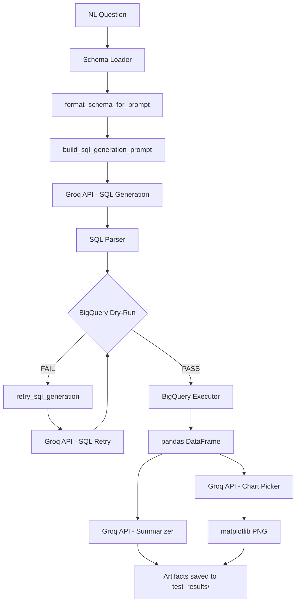

# Text-to-SQL BI Co-Pilot (BigQuery + Groq) — Complete Project Guide

---

## Table of Contents

1. [Project Architecture & Overview](#1-project-architecture--overview)
2. [Repository & Folder Structure](#2-repository--folder-structure)
3. [Production-Ready Implementation Code](#3-production-ready-implementation-code)
4. [Code Logic & Deep-Dive](#4-code-logic--deep-dive)
5. [Deployment & Execution Guide](#5-deployment--execution-guide)
6. [Intern Viva & Code Review Questions](#6-intern-viva--code-review-questions)
7. [Additional Deliverables](#7-additional-deliverables)

---

## 1. Project Architecture & Overview

### What This System Does

This project is a **Text-to-SQL BI Co-Pilot** — an agent that accepts a plain-English question, understands the structure of a BigQuery table, generates valid SQL using a large language model, validates the SQL before execution, runs the query, and returns both a human-readable summary and a rendered chart.

The entire LLM layer is powered by **Groq's API** using `llama-3.3-70b-versatile`. Groq is chosen for three reasons:

- **Speed:** Groq's LPU hardware delivers sub-second token generation, which is critical for an interactive BI tool.
- **Cost:** Significantly cheaper per token than comparable closed models for a 70B-parameter model.
- **Quality:** LLaMA 3.3 70B produces SQL that closely follows schema constraints, reducing hallucination when prompted correctly.

**BigQuery** is used as the data warehouse because it is serverless, scales instantly, exposes rich public datasets, and provides a `dry_run` mode that acts as a compile-time SQL validator without executing the query or incurring cost.

### LLM Pipeline Topology

```
NL Question
     │
     ▼
Schema Loader ──── BigQuery Table Metadata ────► Format Schema String
     │                                                   │
     ▼                                                   ▼
Prompt Builder ◄────────────────────────────── Schema String + NL Question
     │
     ▼
Groq API (llama-3.3-70b-versatile, temp=0.1)
     │
     ▼
SQL Parser (strip markdown fences, whitespace)
     │
     ▼
BigQuery Dry-Run Validator
     │             │
   PASS          FAIL ──► Retry Prompt Builder (inject error + bad SQL)
     │                          │
     │                    Groq API (Retry)
     │                          │
     │                    (max 2 retries)
     │                          │
     ◄──────────────────────────┘
     │
     ▼
BigQuery Executor (actual query run)
     │
     ▼
pandas DataFrame
     │
     ├──► Summarizer (Groq API → 2-3 sentence NL summary)
     │
     └──► Chart Picker (Groq API → bar/line/pie/scatter/table)
               │
               ▼
         matplotlib PNG
               │
               ▼
     test_results/query_{id}/ artifacts saved
```

### Mermaid Diagram



### Technology Choices Summary

| Component | Technology | Reason |
|-----------|-----------|--------|
| LLM Provider | Groq (`llama-3.3-70b-versatile`) | Speed, cost, SQL quality |
| Data Warehouse | Google BigQuery | Serverless, dry-run validation, public data |
| BQ SDK | `google-cloud-bigquery` | Official SDK, ADC auth support |
| Charting | `matplotlib` | Ubiquitous, file-based PNG output |
| Data Frames | `pandas` | Standard for tabular manipulation |
| Logging | Python `logging` | Dual-sink (file + stdout), structured format |

---

## 2. Repository & Folder Structure

### ASCII Tree

```
text2sql/
├── config/
│   └── settings.py           # Env var loading, constants, fail-fast checks
├── src/
│   ├── utils/
│   │   └── logger.py         # Dual-sink logger (stdout + output.log)
│   ├── schema_loader.py      # BQ client, schema fetch, sample values
│   ├── sql_validator.py      # dry_run_query, retry_sql_generation
│   ├── agent.py              # Orchestrator: run_pipeline, generate_sql, execute_query
│   ├── summarizer.py         # NL summary via Groq
│   └── chart_picker.py       # Chart type selection + matplotlib rendering
├── tests/
│   └── test_queries.py       # 15 NL queries (easy/medium/hard), batch runner
├── test_results/             # Auto-created; one subfolder per query run
│   └── query_1/
│       ├── nl_question.txt
│       ├── generated_sql.sql
│       ├── validation_status.txt
│       ├── result_table.csv
│       ├── nl_summary.txt
│       ├── chart.png
│       └── success.txt  (or failure.txt)
├── myenv/                    # Virtual environment (created by setup.sh)
├── setup.sh                  # One-shot directory + file scaffold script
├── requirements.txt          # Python dependencies with version pins
├── output.log                # Appended structured logs from all runs
├── README.md                 # Blank; intern fills in
├── dataset_choice.md         # Dataset rationale (intern fills in)
├── test_queries.md           # 15 NL queries listed (intern fills in)
├── learnings.md              # Post-run reflections (intern fills in)
└── questions.md              # Viva questions
```

### Separation of Concerns

- **`config/`** — Environment and constant definitions only. No business logic. Imported by all other modules.
- **`src/`** — Pure business logic. Each file has one job: loading schemas, validating SQL, orchestrating the pipeline, summarizing, charting.
- **`src/utils/`** — Cross-cutting concerns (logging). Never imports from `src/` to avoid circular dependencies.
- **`tests/`** — Entry point for humans and CI. Imports from `src/` and `config/`.
- **`test_results/`** — Write-only artifact store. One folder per query run. Versioned by query ID.

### `setup.sh`

```bash
#!/usr/bin/env bash
# setup.sh — Scaffold the entire text2sql project in one command.
# Usage: chmod +x setup.sh && ./setup.sh

set -e  # Exit immediately on any error

echo "==> Creating directory structure..."

mkdir -p text2sql/config
mkdir -p text2sql/src/utils
mkdir -p text2sql/tests
mkdir -p text2sql/test_results

echo "==> Touching all source files..."

touch text2sql/config/__init__.py
touch text2sql/config/settings.py

touch text2sql/src/__init__.py
touch text2sql/src/utils/__init__.py
touch text2sql/src/utils/logger.py
touch text2sql/src/schema_loader.py
touch text2sql/src/sql_validator.py
touch text2sql/src/agent.py
touch text2sql/src/summarizer.py
touch text2sql/src/chart_picker.py

touch text2sql/tests/__init__.py
touch text2sql/tests/test_queries.py

touch text2sql/requirements.txt
touch text2sql/output.log
touch text2sql/dataset_choice.md
touch text2sql/test_queries.md
touch text2sql/learnings.md
touch text2sql/questions.md

echo "==> Creating blank README.md..."
echo "# Text-to-SQL BI Co-Pilot" > text2sql/README.md

echo "==> Creating Python virtual environment (myenv)..."
cd text2sql
python3 -m venv myenv

echo ""
echo "✅ Scaffold complete!"
echo ""
echo "Next steps:"
echo "  cd text2sql"
echo "  source myenv/bin/activate"
echo "  pip install -r requirements.txt"
echo "  export GROQ_API_KEY=\"gsk_...\""
echo "  export GOOGLE_APPLICATION_CREDENTIALS=\"/path/to/key.json\""
echo "  python tests/test_queries.py"
```

---

## 3. Production-Ready Implementation Code

### `requirements.txt`

```text
groq==0.9.0
google-cloud-bigquery==3.25.0
google-auth==2.32.0
pandas==2.2.2
matplotlib==3.9.1
db-dtypes==1.3.0
pyarrow==17.0.0
```

> **Note:** `db-dtypes` and `pyarrow` are required for BigQuery to correctly deserialise DATE, TIMESTAMP, and NUMERIC columns into a pandas DataFrame. Without them you will see deserialization warnings or errors on non-primitive column types.

---

### `config/settings.py`

```python
"""
config/settings.py

Loads all environment variables and defines project-wide constants.
Uses STRICT / FAIL-FAST error handling: if required env vars are missing,
the process logs a critical error and exits immediately (sys.exit(1)).
This prevents silent failures where the pipeline runs but uses wrong credentials.
"""

import os
import sys
import logging

# ---------------------------------------------------------------------------
# Bootstrap a minimal logger for the settings module itself.
# The full dual-sink logger (src/utils/logger.py) is configured later,
# but we need logging available here to report configuration failures.
# ---------------------------------------------------------------------------
logging.basicConfig(
    format="%(asctime)s | %(levelname)s | %(message)s",
    level=logging.INFO,
)
_log = logging.getLogger(__name__)

# ---------------------------------------------------------------------------
# Required environment variables — FAIL FAST if missing
# ---------------------------------------------------------------------------

GROQ_API_KEY: str = os.environ.get("GROQ_API_KEY", "")
if not GROQ_API_KEY:
    _log.critical(
        "GROQ_API_KEY environment variable is not set. "
        "Export it with: export GROQ_API_KEY='gsk_...'"
    )
    sys.exit(1)

GOOGLE_APPLICATION_CREDENTIALS: str = os.environ.get(
    "GOOGLE_APPLICATION_CREDENTIALS", ""
)
if not GOOGLE_APPLICATION_CREDENTIALS:
    _log.critical(
        "GOOGLE_APPLICATION_CREDENTIALS environment variable is not set. "
        "Export it with: export GOOGLE_APPLICATION_CREDENTIALS='/path/to/key.json'"
    )
    sys.exit(1)

if not os.path.isfile(GOOGLE_APPLICATION_CREDENTIALS):
    _log.critical(
        f"GOOGLE_APPLICATION_CREDENTIALS points to a non-existent file: "
        f"{GOOGLE_APPLICATION_CREDENTIALS}"
    )
    sys.exit(1)

# ---------------------------------------------------------------------------
# Groq / LLM constants
# ---------------------------------------------------------------------------

GROQ_MODEL: str = "llama-3.3-70b-versatile"

# Temperature for SQL generation — low value keeps output deterministic.
# Temperature for summarization and chart picking — slightly higher is fine.
SQL_TEMPERATURE: float = 0.1
SUMMARIZE_TEMPERATURE: float = 0.3
CHART_TEMPERATURE: float = 0.2

MAX_TOKENS: int = 1024          # Max tokens in LLM response
MAX_SQL_RETRIES: int = 2        # Max retries after dry-run failure (3 total attempts)

# ---------------------------------------------------------------------------
# BigQuery dataset / table constants
# ---------------------------------------------------------------------------

PROJECT_ID: str = "bigquery-public-data"
DATASET_ID: str = "new_york_taxi_trips"
TABLE_ID: str = "tlc_yellow_trips_2015"

# Fully-qualified table reference used in SQL generation prompts
FULL_TABLE_REF: str = f"`{PROJECT_ID}.{DATASET_ID}.{TABLE_ID}`"

# Maximum number of schema columns to include in the prompt before truncating.
# llama-3.3-70b-versatile has a 128k context window, but shorter prompts
# produce more reliable SQL.
MAX_SCHEMA_COLUMNS: int = 40

# Number of sample distinct values to fetch per column for the schema prompt.
SAMPLE_VALUES_PER_COLUMN: int = 3

# ---------------------------------------------------------------------------
# File paths
# ---------------------------------------------------------------------------

# Resolve project root as the parent of this config/ directory
PROJECT_ROOT: str = os.path.dirname(os.path.dirname(os.path.abspath(__file__)))
LOG_FILE: str = os.path.join(PROJECT_ROOT, "output.log")
TEST_RESULTS_DIR: str = os.path.join(PROJECT_ROOT, "test_results")
```

---

### `src/utils/logger.py`

```python
"""
src/utils/logger.py

Configures a project-wide logger that writes to BOTH:
  1. stdout (StreamHandler) — for live terminal feedback
  2. output.log in the project root (FileHandler, mode='a') — for persistence

Log format: TIMESTAMP | LEVEL | MESSAGE
Example:    2026-06-23 14:30:00,123 | INFO | Starting schema load

This module exposes a single function `get_logger(name)` that every other
module calls to obtain a correctly configured logger instance.

Design decision: Using a single shared FileHandler (attached to the root logger)
ensures all modules write to the same output.log without duplicating entries,
even if get_logger() is called multiple times with the same name.
"""

import logging
import sys
from config.settings import LOG_FILE

# ---------------------------------------------------------------------------
# Custom formatter — produces the required pipe-delimited format
# ---------------------------------------------------------------------------
_FORMATTER = logging.Formatter(
    fmt="%(asctime)s | %(levelname)s | %(message)s",
    datefmt="%Y-%m-%d %H:%M:%S",
)

# ---------------------------------------------------------------------------
# Flag to ensure handlers are attached to the root logger only once,
# even if get_logger() is called from multiple modules at import time.
# ---------------------------------------------------------------------------
_HANDLERS_CONFIGURED = False


def _configure_root_logger() -> None:
    """Attach FileHandler and StreamHandler to the root logger exactly once."""
    global _HANDLERS_CONFIGURED
    if _HANDLERS_CONFIGURED:
        return

    root = logging.getLogger()
    root.setLevel(logging.DEBUG)  # Root captures everything; handlers filter

    # --- File handler: append to output.log in project root ---
    file_handler = logging.FileHandler(LOG_FILE, mode="a", encoding="utf-8")
    file_handler.setLevel(logging.DEBUG)
    file_handler.setFormatter(_FORMATTER)

    # --- Stream handler: write INFO+ to stdout ---
    stream_handler = logging.StreamHandler(sys.stdout)
    stream_handler.setLevel(logging.INFO)
    stream_handler.setFormatter(_FORMATTER)

    root.addHandler(file_handler)
    root.addHandler(stream_handler)

    _HANDLERS_CONFIGURED = True


def get_logger(name: str) -> logging.Logger:
    """
    Return a named logger. All named loggers propagate to the root logger,
    which holds the actual handlers (file + stream).

    Args:
        name: Typically __name__ of the calling module.

    Returns:
        A configured logging.Logger instance.
    """
    _configure_root_logger()
    return logging.getLogger(name)
```

---

### `src/schema_loader.py`

```python
"""
src/schema_loader.py

Responsibilities:
  1. Create and return an authenticated BigQuery client.
  2. Fetch the schema of a specified table.
  3. Format the schema into a prompt-friendly string, including sample values.

Design decisions:
  - BigQuery client creation uses Application Default Credentials (ADC).
    The GOOGLE_APPLICATION_CREDENTIALS env var (set in settings.py) points to
    the service account JSON key, which ADC picks up automatically.
  - Sample values are fetched with a LIMIT query per column. This gives the LLM
    concrete examples of what data looks like, dramatically reducing hallucinated
    column names (e.g., the LLM won't guess "pickup_date" if it sees "tpep_pickup_datetime").
  - Schema truncation: if the table has more columns than MAX_SCHEMA_COLUMNS,
    we prioritize by dropping columns whose names suggest they are low-value for
    SQL generation (e.g., internal IDs, surcharge breakdowns).
"""

import sys
from google.cloud import bigquery
from google.api_core.exceptions import GoogleAPIError
from config.settings import (
    PROJECT_ID,
    DATASET_ID,
    TABLE_ID,
    MAX_SCHEMA_COLUMNS,
    SAMPLE_VALUES_PER_COLUMN,
)
from src.utils.logger import get_logger

logger = get_logger(__name__)

# ---------------------------------------------------------------------------
# BigQuery client factory — STRICT / FAIL-FAST
# ---------------------------------------------------------------------------

def get_bigquery_client() -> bigquery.Client:
    """
    Create and return a BigQuery Client using Application Default Credentials.

    Exits the process with code 1 if client creation fails — this is a fatal
    infrastructure error that cannot be recovered from gracefully.

    Returns:
        An authenticated bigquery.Client instance.
    """
    logger.info("Initializing BigQuery client...")
    try:
        client = bigquery.Client()
        logger.info("BigQuery client initialized successfully.")
        return client
    except Exception as exc:
        logger.critical(
            f"Failed to initialize BigQuery client. "
            f"Check GOOGLE_APPLICATION_CREDENTIALS. Error: {exc}"
        )
        sys.exit(1)


# Module-level singleton client — created once and reused across all calls.
# This avoids repeated ADC negotiation on every schema fetch.
_bq_client: bigquery.Client | None = None


def _get_client() -> bigquery.Client:
    """Return the module-level BigQuery client, creating it if necessary."""
    global _bq_client
    if _bq_client is None:
        _bq_client = get_bigquery_client()
    return _bq_client


# ---------------------------------------------------------------------------
# Schema fetching
# ---------------------------------------------------------------------------

def fetch_table_schema(dataset_id: str, table_id: str) -> bigquery.Table:
    """
    Fetch the BigQuery Table object, which contains the schema (field definitions).

    Args:
        dataset_id: BigQuery dataset name (e.g., "new_york_taxi_trips").
        table_id: Table name (e.g., "tlc_yellow_trips_2015").

    Returns:
        A bigquery.Table object with the full schema.

    Raises:
        SystemExit: If the table cannot be fetched (fail-fast behaviour).
    """
    client = _get_client()
    full_table_id = f"{PROJECT_ID}.{dataset_id}.{table_id}"
    logger.info(f"Fetching schema for table: {full_table_id}")
    try:
        table = client.get_table(full_table_id)
        logger.info(
            f"Schema fetched. Table has {len(table.schema)} columns, "
            f"approximately {table.num_rows:,} rows."
        )
        return table
    except GoogleAPIError as exc:
        logger.critical(
            f"Failed to fetch schema for {full_table_id}. "
            f"Check that the table exists and the service account has BigQuery Data Viewer role. "
            f"Error: {exc}"
        )
        sys.exit(1)


# ---------------------------------------------------------------------------
# Sample value fetching
# ---------------------------------------------------------------------------

def _fetch_sample_values(
    dataset_id: str,
    table_id: str,
    column_name: str,
    n: int = SAMPLE_VALUES_PER_COLUMN,
) -> list[str]:
    """
    Fetch up to `n` distinct non-null sample values for a single column.
    Used to populate the schema prompt with concrete examples.

    Args:
        dataset_id: BigQuery dataset name.
        table_id: Table name.
        column_name: Column to sample.
        n: Number of distinct values to retrieve.

    Returns:
        A list of string representations of the sample values.
        Returns an empty list on failure (graceful — sampling is best-effort).
    """
    client = _get_client()
    full_ref = f"`{PROJECT_ID}.{dataset_id}.{table_id}`"
    # SAFE_CAST to STRING handles all column types (TIMESTAMP, FLOAT, etc.)
    sql = (
        f"SELECT DISTINCT SAFE_CAST(`{column_name}` AS STRING) AS val "
        f"FROM {full_ref} "
        f"WHERE `{column_name}` IS NOT NULL "
        f"LIMIT {n}"
    )
    try:
        rows = list(client.query(sql).result())
        return [str(row.val) for row in rows if row.val is not None]
    except Exception as exc:
        logger.warning(
            f"Could not fetch sample values for column '{column_name}': {exc}"
        )
        return []


# ---------------------------------------------------------------------------
# Schema → prompt string
# ---------------------------------------------------------------------------

def format_schema_for_prompt(
    dataset_id: str = DATASET_ID,
    table_id: str = TABLE_ID,
) -> str:
    """
    Build a human-readable schema string suitable for injection into an LLM prompt.

    Each column line looks like:
      - vendor_id (STRING, NULLABLE) — sample values: ['1', '2', 'CMT']

    If the table has more than MAX_SCHEMA_COLUMNS columns, the schema is truncated
    by dropping columns whose names suggest low analytical value (internal IDs,
    surcharge breakdowns). A truncation notice is appended so the LLM knows the
    schema is not exhaustive.

    Args:
        dataset_id: BigQuery dataset name.
        table_id: Table name.

    Returns:
        A formatted schema string ready to embed in a prompt.
    """
    table = fetch_table_schema(dataset_id, table_id)
    schema_fields = list(table.schema)

    # --- Truncation strategy ---
    if len(schema_fields) > MAX_SCHEMA_COLUMNS:
        logger.warning(
            f"Table has {len(schema_fields)} columns; truncating to {MAX_SCHEMA_COLUMNS} "
            f"for context window management."
        )
        # Heuristic: deprioritise columns with these substrings in their names
        low_priority_keywords = ["surcharge", "tax", "_id", "store_and", "improvement"]
        priority_fields = [
            f for f in schema_fields
            if not any(kw in f.name.lower() for kw in low_priority_keywords)
        ]
        # Fill remaining budget with the rest
        remaining = [f for f in schema_fields if f not in priority_fields]
        schema_fields = (priority_fields + remaining)[:MAX_SCHEMA_COLUMNS]

    full_table_ref = f"`{PROJECT_ID}.{dataset_id}.{table_id}`"
    lines = [
        f"Table: {full_table_ref}",
        f"Columns ({len(schema_fields)} shown):",
    ]

    for field in schema_fields:
        logger.debug(f"Fetching sample values for column: {field.name}")
        samples = _fetch_sample_values(dataset_id, table_id, field.name)
        sample_str = str(samples) if samples else "N/A"
        lines.append(
            f"  - {field.name} ({field.field_type}, {field.mode}) "
            f"— sample values: {sample_str}"
        )

    if len(table.schema) > MAX_SCHEMA_COLUMNS:
        lines.append(
            f"\n[NOTE: Schema truncated. Table has {len(table.schema)} total columns. "
            f"Use only the columns listed above.]"
        )

    schema_string = "\n".join(lines)
    logger.info(
        f"Schema formatted for prompt. Total characters: {len(schema_string)}"
    )
    return schema_string
```

---

### `src/sql_validator.py`

```python
"""
src/sql_validator.py

Responsibilities:
  1. dry_run_query: Use BigQuery's dry-run mode to validate SQL without executing it.
  2. retry_sql_generation: Build a correction prompt and call Groq to produce
     a fixed SQL statement after a dry-run failure.

BigQuery dry-run acts as a compile-time check:
  - It parses the SQL and resolves all column/table references against the actual schema.
  - It returns the estimated bytes scanned (useful for cost control).
  - It raises google.api_core.exceptions.BadRequest with a structured error message
    if the SQL is invalid. That exact error message is injected back into the retry prompt.

Design decision — why inject the raw BigQuery error?
  LLMs respond much better to correction prompts that include the actual error
  (e.g., "Unrecognized name: pickup_date; Did you mean tpep_pickup_datetime?")
  than to vague instructions like "the SQL was invalid, try again".
"""

import groq as groq_sdk
from google.cloud import bigquery
from google.api_core.exceptions import BadRequest

from config.settings import (
    GROQ_API_KEY,
    GROQ_MODEL,
    SQL_TEMPERATURE,
    MAX_TOKENS,
)
from src.utils.logger import get_logger
from src.schema_loader import _get_client  # reuse module-level BQ client

logger = get_logger(__name__)

# Groq client — module-level singleton
_groq_client = groq_sdk.Groq(api_key=GROQ_API_KEY)


# ---------------------------------------------------------------------------
# Dry-run validation
# ---------------------------------------------------------------------------

def dry_run_query(sql: str) -> tuple[bool, str]:
    """
    Submit a SQL query to BigQuery in dry-run mode.

    Dry-run mode parses and validates the SQL against the real schema without
    actually scanning any data. Cost: $0.00 per dry run.

    Args:
        sql: The SQL string to validate.

    Returns:
        (True, "") if the SQL is valid.
        (False, error_message) if BigQuery rejects the SQL.
    """
    client = _get_client()
    job_config = bigquery.QueryJobConfig(dry_run=True, use_query_cache=False)

    logger.info(f"Running BigQuery dry-run validation. SQL length: {len(sql)} chars.")
    logger.debug(f"SQL to validate:\n{sql}")

    try:
        # A dry-run job returns immediately without executing the query.
        # If the SQL is valid, job.total_bytes_processed contains the estimate.
        job = client.query(sql, job_config=job_config)
        estimated_bytes = job.total_bytes_processed
        logger.info(
            f"Dry-run PASSED. Estimated bytes to scan: "
            f"{estimated_bytes / 1e6:.2f} MB"
        )
        return True, ""
    except BadRequest as exc:
        # BigQuery returns a structured error — extract the human-readable message.
        error_message = str(exc)
        logger.warning(f"Dry-run FAILED. BigQuery error: {error_message}")
        return False, error_message
    except Exception as exc:
        # Catch unexpected errors (network issues, quota exceeded, etc.)
        error_message = f"Unexpected dry-run error: {exc}"
        logger.error(error_message)
        return False, error_message


# ---------------------------------------------------------------------------
# SQL retry via Groq
# ---------------------------------------------------------------------------

def retry_sql_generation(
    nl_question: str,
    schema: str,
    failed_sql: str,
    error_msg: str,
    attempt: int,
) -> str:
    """
    Build a correction prompt and ask Groq to produce a fixed SQL statement.

    The correction prompt explicitly includes:
      - The original natural language question (so the LLM remembers the intent)
      - The table schema (so it can reference correct column names)
      - The SQL that failed (so it understands what was wrong)
      - The exact BigQuery error message (the most actionable correction signal)

    Args:
        nl_question: The original user question.
        schema: The formatted schema string from format_schema_for_prompt().
        failed_sql: The SQL statement that failed the dry-run.
        error_msg: The error message returned by BigQuery.
        attempt: The current retry attempt number (1 or 2), used for logging.

    Returns:
        A new SQL string (stripped of markdown fences).
    """
    logger.info(
        f"Retrying SQL generation. Attempt {attempt} of 2. "
        f"Injecting BigQuery error into correction prompt."
    )

    # Construct a correction prompt using chain-of-thought style:
    # 1. Restate the goal.
    # 2. Show what went wrong.
    # 3. Ask for a correction.
    system_prompt = (
        "You are an expert BigQuery SQL engineer. "
        "You previously generated a SQL query that failed BigQuery validation. "
        "Your task is to correct the SQL based on the error message provided. "
        "Return ONLY the corrected raw SQL query. "
        "Do NOT wrap it in markdown code fences. "
        "Do NOT include any explanation. "
        "Use only the exact column names listed in the schema."
    )

    user_prompt = (
        f"Original question: {nl_question}\n\n"
        f"Schema:\n{schema}\n\n"
        f"Previous (invalid) SQL:\n{failed_sql}\n\n"
        f"BigQuery error message:\n{error_msg}\n\n"
        f"Please provide the corrected SQL query."
    )

    logger.info(
        f"Sending retry prompt to Groq. Model: {GROQ_MODEL}. "
        f"Prompt length (approx chars): {len(system_prompt) + len(user_prompt)}"
    )

    try:
        response = _groq_client.chat.completions.create(
            model=GROQ_MODEL,
            messages=[
                {"role": "system", "content": system_prompt},
                {"role": "user", "content": user_prompt},
            ],
            temperature=SQL_TEMPERATURE,
            max_tokens=MAX_TOKENS,
        )

        corrected_sql = response.choices[0].message.content.strip()
        finish_reason = response.choices[0].finish_reason
        usage = response.usage

        logger.info(
            f"Groq retry response received. "
            f"Tokens used — prompt: {usage.prompt_tokens}, "
            f"completion: {usage.completion_tokens}. "
            f"Finish reason: {finish_reason}"
        )

        # Strip markdown fences if the model added them despite instructions
        corrected_sql = _strip_sql_fences(corrected_sql)
        logger.info(f"Corrected SQL (attempt {attempt}):\n{corrected_sql}")
        return corrected_sql

    except Exception as exc:
        logger.error(f"Groq API call failed during SQL retry: {exc}")
        # Return the original failed SQL so the caller can handle the failure
        return failed_sql


def _strip_sql_fences(text: str) -> str:
    """
    Remove markdown code fences from a SQL string.

    Models sometimes wrap SQL in ```sql ... ``` despite being instructed not to.
    This function handles both ```sql and ``` fences.

    Args:
        text: Raw LLM output.

    Returns:
        Clean SQL string with no markdown wrapping.
    """
    text = text.strip()
    if text.startswith("```"):
        lines = text.split("\n")
        # Remove first line (```sql or ```) and last line (```)
        if lines[-1].strip() == "```":
            lines = lines[1:-1]
        else:
            lines = lines[1:]
        text = "\n".join(lines).strip()
    return text
```

---

### `src/agent.py`

```python
"""
src/agent.py

The orchestrator of the Text-to-SQL pipeline.

Responsibilities:
  1. build_sql_generation_prompt: Compose the system + user prompt for SQL generation.
  2. generate_sql: Call Groq and parse the raw SQL from the response.
  3. execute_query: Run validated SQL on BigQuery and return a DataFrame.
  4. run_pipeline: End-to-end orchestration for a single NL question.

The run_pipeline function follows this sequence:
  1. Fetch and format schema.
  2. Generate SQL via Groq.
  3. Dry-run validate. On failure, retry up to MAX_SQL_RETRIES times.
  4. Execute the validated SQL.
  5. Summarize results.
  6. Pick a chart type and render PNG.
  7. Save all artifacts to test_results/query_{query_id}/.
  8. Return a status dictionary for the batch runner.
"""

import os
import sys
import pandas as pd
import groq as groq_sdk
from google.cloud import bigquery

from config.settings import (
    GROQ_API_KEY,
    GROQ_MODEL,
    SQL_TEMPERATURE,
    MAX_TOKENS,
    MAX_SQL_RETRIES,
    TEST_RESULTS_DIR,
    PROJECT_ID,
    DATASET_ID,
    TABLE_ID,
)
from src.utils.logger import get_logger
from src.schema_loader import format_schema_for_prompt, _get_client
from src.sql_validator import dry_run_query, retry_sql_generation, _strip_sql_fences
from src.summarizer import summarize
from src.chart_picker import pick_chart, render_chart

logger = get_logger(__name__)

# Groq client — module-level singleton
_groq_client = groq_sdk.Groq(api_key=GROQ_API_KEY)


# ---------------------------------------------------------------------------
# Prompt construction
# ---------------------------------------------------------------------------

def build_sql_generation_prompt(question: str, schema: str) -> tuple[str, str]:
    """
    Build the system prompt and user prompt for SQL generation.

    Design choices in the prompt:
      - The system prompt establishes the model's role and hard constraints
        (use only listed columns, no markdown fences, BigQuery dialect).
      - The user prompt provides the schema and the specific question.
      - Temperature is kept at 0.1 so the model prefers the most statistically
        common (correct) SQL patterns over creative/hallucinated ones.
      - Explicit instruction "use only the columns listed" is the single most
        effective technique for preventing column name hallucination.

    Args:
        question: The natural language question from the user.
        schema: The formatted schema string from format_schema_for_prompt().

    Returns:
        A tuple of (system_prompt, user_prompt).
    """
    system_prompt = (
        "You are an expert BigQuery SQL engineer with deep knowledge of the "
        "Google Cloud BigQuery dialect. Your only job is to write a single, "
        "valid BigQuery SQL query that answers the user's question.\n\n"
        "STRICT RULES:\n"
        "1. Use ONLY the column names and table name provided in the schema below.\n"
        "2. Do NOT invent column names that are not in the schema.\n"
        "3. Use standard BigQuery SQL syntax (backtick-quoted identifiers, "
        "TIMESTAMP functions, EXTRACT, etc.).\n"
        "4. Return ONLY the raw SQL query — no markdown code fences, "
        "no explanations, no comments.\n"
        "5. Ensure the query is complete and executable as-is.\n"
        "6. For aggregation queries, always include a LIMIT clause (e.g., LIMIT 100) "
        "to prevent accidentally scanning billions of rows.\n"
        "7. For date/time filtering, use BigQuery TIMESTAMP or DATE functions correctly."
    )

    user_prompt = (
        f"Schema:\n{schema}\n\n"
        f"Question: {question}\n\n"
        f"Write the BigQuery SQL query:"
    )

    return system_prompt, user_prompt


# ---------------------------------------------------------------------------
# SQL generation via Groq
# ---------------------------------------------------------------------------

def generate_sql(system_prompt: str, user_prompt: str) -> str:
    """
    Call the Groq API to generate a SQL query.

    Logs:
      - Approximate prompt token count (character count / 4 as heuristic)
      - Model used
      - Response token counts and finish reason

    Args:
        system_prompt: The system-role prompt string.
        user_prompt: The user-role prompt string.

    Returns:
        A SQL string with markdown fences stripped.

    Raises:
        RuntimeError: If the Groq API call fails after internal retries.
    """
    approx_prompt_tokens = (len(system_prompt) + len(user_prompt)) // 4
    logger.info(
        f"Calling Groq API for SQL generation. "
        f"Model: {GROQ_MODEL}. "
        f"Approx prompt tokens: {approx_prompt_tokens}."
    )

    try:
        response = _groq_client.chat.completions.create(
            model=GROQ_MODEL,
            messages=[
                {"role": "system", "content": system_prompt},
                {"role": "user", "content": user_prompt},
            ],
            temperature=SQL_TEMPERATURE,
            max_tokens=MAX_TOKENS,
        )

        raw_sql = response.choices[0].message.content.strip()
        finish_reason = response.choices[0].finish_reason
        usage = response.usage

        logger.info(
            f"Groq SQL generation complete. "
            f"Prompt tokens: {usage.prompt_tokens}. "
            f"Completion tokens: {usage.completion_tokens}. "
            f"Finish reason: {finish_reason}."
        )

        # Strip markdown fences defensively even though we instructed the model
        # not to include them — models occasionally disobey.
        sql = _strip_sql_fences(raw_sql)
        logger.info(f"Generated SQL:\n{sql}")
        return sql

    except groq_sdk.APIConnectionError as exc:
        raise RuntimeError(f"Groq API connection error: {exc}") from exc
    except groq_sdk.RateLimitError as exc:
        raise RuntimeError(f"Groq API rate limit exceeded: {exc}") from exc
    except groq_sdk.APIStatusError as exc:
        raise RuntimeError(
            f"Groq API status error {exc.status_code}: {exc.message}"
        ) from exc


# ---------------------------------------------------------------------------
# BigQuery query execution
# ---------------------------------------------------------------------------

def execute_query(sql: str) -> pd.DataFrame:
    """
    Execute a validated SQL query against BigQuery and return the result as a DataFrame.

    Args:
        sql: A BigQuery SQL string that has already passed dry-run validation.

    Returns:
        A pandas DataFrame containing the query results.

    Raises:
        RuntimeError: If query execution fails.
    """
    client = _get_client()
    logger.info(f"Executing BigQuery query. SQL length: {len(sql)} chars.")

    try:
        query_job = client.query(sql)
        df = query_job.to_dataframe()
        logger.info(
            f"Query execution complete. "
            f"Rows returned: {len(df)}. "
            f"Columns: {list(df.columns)}."
        )
        return df
    except Exception as exc:
        raise RuntimeError(f"BigQuery query execution failed: {exc}") from exc


# ---------------------------------------------------------------------------
# Artifact saving
# ---------------------------------------------------------------------------

def _save_artifacts(
    query_id: int,
    nl_question: str,
    sql: str,
    validation_status: str,
    df: pd.DataFrame | None,
    summary: str,
    chart_path: str | None,
    success: bool,
    error: str = "",
) -> str:
    """
    Save all pipeline artifacts for a single query to test_results/query_{query_id}/.

    Creates the directory if it does not exist.

    Returns:
        The path to the artifact directory.
    """
    artifact_dir = os.path.join(TEST_RESULTS_DIR, f"query_{query_id}")
    os.makedirs(artifact_dir, exist_ok=True)
    logger.info(f"Saving artifacts to: {artifact_dir}")

    # 1. Natural language question
    with open(os.path.join(artifact_dir, "nl_question.txt"), "w") as f:
        f.write(nl_question)

    # 2. Generated SQL
    with open(os.path.join(artifact_dir, "generated_sql.sql"), "w") as f:
        f.write(sql)

    # 3. Validation status
    with open(os.path.join(artifact_dir, "validation_status.txt"), "w") as f:
        f.write(validation_status)

    # 4. Result table as CSV
    if df is not None and not df.empty:
        df.to_csv(os.path.join(artifact_dir, "result_table.csv"), index=False)
    else:
        with open(os.path.join(artifact_dir, "result_table.csv"), "w") as f:
            f.write("(empty result)\n")

    # 5. NL summary
    with open(os.path.join(artifact_dir, "nl_summary.txt"), "w") as f:
        f.write(summary)

    # 6. Chart PNG — if chart was generated, it was already saved to chart_path
    # Copy the chart to the artifact directory if it's not already there
    if chart_path and os.path.exists(chart_path):
        target = os.path.join(artifact_dir, "chart.png")
        if os.path.abspath(chart_path) != os.path.abspath(target):
            import shutil
            shutil.copy2(chart_path, target)

    # 7. Success or failure marker
    if success:
        with open(os.path.join(artifact_dir, "success.txt"), "w") as f:
            f.write("Pipeline completed successfully.\n")
    else:
        with open(os.path.join(artifact_dir, "failure.txt"), "w") as f:
            f.write(f"Pipeline failed.\nError: {error}\n")

    logger.info(f"All artifacts saved for query_{query_id}.")
    return artifact_dir


# ---------------------------------------------------------------------------
# Main pipeline
# ---------------------------------------------------------------------------

def run_pipeline(question: str, query_id: int) -> dict:
    """
    Execute the full Text-to-SQL pipeline for a single natural language question.

    Steps:
      1. Fetch and format the BigQuery table schema.
      2. Build SQL generation prompt.
      3. Call Groq to generate SQL.
      4. Dry-run validate the SQL in BigQuery.
         - On failure, retry up to MAX_SQL_RETRIES times with error injection.
         - If all retries fail, return a graceful error dict.
      5. Execute the validated SQL and retrieve a DataFrame.
      6. Summarize the results using Groq.
      7. Pick a chart type and render a PNG.
      8. Save all artifacts to test_results/query_{query_id}/.
      9. Return a status dict for the batch runner.

    Args:
        question: The natural language question to answer.
        query_id: An integer identifier used to name the artifact directory.

    Returns:
        A dict with keys: query_id, question, success (bool), error (str),
        sql, summary, artifact_dir.
    """
    logger.info(
        f"=== Starting pipeline for query_id={query_id} === "
        f"Question: '{question}'"
    )

    # ------------------------------------------------------------------
    # Step 1: Schema loading — STRICT (exits on failure via schema_loader)
    # ------------------------------------------------------------------
    schema = format_schema_for_prompt(DATASET_ID, TABLE_ID)

    # ------------------------------------------------------------------
    # Step 2 & 3: Prompt construction and SQL generation
    # ------------------------------------------------------------------
    system_prompt, user_prompt = build_sql_generation_prompt(question, schema)
    try:
        sql = generate_sql(system_prompt, user_prompt)
    except RuntimeError as exc:
        error_msg = f"SQL generation failed: {exc}"
        logger.error(error_msg)
        _save_artifacts(
            query_id, question, "", "GENERATION_FAILED", None,
            error_msg, None, False, error_msg
        )
        return {
            "query_id": query_id, "question": question,
            "success": False, "error": error_msg,
            "sql": "", "summary": "", "artifact_dir": "",
        }

    # ------------------------------------------------------------------
    # Step 4: Dry-run validation with retry loop — LENIENT
    # ------------------------------------------------------------------
    current_sql = sql
    validation_passed = False
    last_error = ""

    for attempt in range(MAX_SQL_RETRIES + 1):  # attempt 0, 1, 2 = 3 total tries
        valid, bq_error = dry_run_query(current_sql)

        if valid:
            validation_passed = True
            logger.info(f"SQL passed dry-run validation on attempt {attempt + 1}.")
            break
        else:
            last_error = bq_error
            if attempt < MAX_SQL_RETRIES:
                logger.warning(
                    f"Dry-run failed on attempt {attempt + 1}. "
                    f"Retrying SQL generation ({attempt + 1}/{MAX_SQL_RETRIES})."
                )
                current_sql = retry_sql_generation(
                    nl_question=question,
                    schema=schema,
                    failed_sql=current_sql,
                    error_msg=bq_error,
                    attempt=attempt + 1,
                )
            else:
                logger.error(
                    f"SQL validation failed after {MAX_SQL_RETRIES + 1} total attempts."
                )

    if not validation_passed:
        graceful_message = (
            f"I was unable to generate valid SQL for this question after "
            f"{MAX_SQL_RETRIES + 1} attempts. Error: {last_error}"
        )
        logger.error(graceful_message)
        _save_artifacts(
            query_id, question, current_sql,
            f"FAILED: {last_error}", None,
            graceful_message, None, False, graceful_message
        )
        return {
            "query_id": query_id, "question": question,
            "success": False, "error": graceful_message,
            "sql": current_sql, "summary": graceful_message,
            "artifact_dir": os.path.join(TEST_RESULTS_DIR, f"query_{query_id}"),
        }

    # ------------------------------------------------------------------
    # Step 5: Execute validated SQL
    # ------------------------------------------------------------------
    try:
        df = execute_query(current_sql)
    except RuntimeError as exc:
        error_msg = str(exc)
        logger.error(f"Query execution failed: {error_msg}")
        _save_artifacts(
            query_id, question, current_sql,
            "PASSED_DRY_RUN_BUT_EXECUTION_FAILED", None,
            error_msg, None, False, error_msg
        )
        return {
            "query_id": query_id, "question": question,
            "success": False, "error": error_msg,
            "sql": current_sql, "summary": "", "artifact_dir": "",
        }

    # ------------------------------------------------------------------
    # Step 6: Summarize
    # ------------------------------------------------------------------
    summary = summarize(current_sql, df)

    # ------------------------------------------------------------------
    # Step 7: Chart selection and rendering
    # ------------------------------------------------------------------
    chart_type = pick_chart(df)
    chart_path = os.path.join(TEST_RESULTS_DIR, f"query_{query_id}", "chart.png")
    os.makedirs(os.path.dirname(chart_path), exist_ok=True)
    render_chart(df, chart_type, chart_path)

    # ------------------------------------------------------------------
    # Step 8: Save artifacts
    # ------------------------------------------------------------------
    artifact_dir = _save_artifacts(
        query_id=query_id,
        nl_question=question,
        sql=current_sql,
        validation_status="PASSED",
        df=df,
        summary=summary,
        chart_path=chart_path,
        success=True,
    )

    logger.info(
        f"=== Pipeline complete for query_id={query_id}. "
        f"Artifacts at: {artifact_dir} ==="
    )

    return {
        "query_id": query_id,
        "question": question,
        "success": True,
        "error": "",
        "sql": current_sql,
        "summary": summary,
        "artifact_dir": artifact_dir,
    }
```

---

### `src/summarizer.py`

```python
"""
src/summarizer.py

Generates a concise natural-language summary of a BigQuery query result
using the Groq API.

Design decisions:
  - We send only the first 10 rows of the DataFrame as CSV text.
    Sending the full result (potentially thousands of rows) would:
      a) Exceed the context window for large results.
      b) Not improve summary quality — the LLM derives insight from patterns,
         not from memorising every row.
  - We include the SQL alongside the data so the LLM understands what the
    query was measuring, not just what numbers appeared in the result.
  - The summary is intentionally limited to 2-3 sentences — concise summaries
    are more useful in a BI dashboard context than verbose explanations.
"""

import pandas as pd
import groq as groq_sdk

from config.settings import (
    GROQ_API_KEY,
    GROQ_MODEL,
    SUMMARIZE_TEMPERATURE,
    MAX_TOKENS,
)
from src.utils.logger import get_logger

logger = get_logger(__name__)

# Groq client — module-level singleton
_groq_client = groq_sdk.Groq(api_key=GROQ_API_KEY)

# Maximum number of rows to include in the summarization prompt
MAX_ROWS_FOR_SUMMARY = 10


def summarize(sql: str, df: pd.DataFrame) -> str:
    """
    Generate a 2-3 sentence natural language summary of query results.

    Args:
        sql: The SQL query that was executed (included for context).
        df: The pandas DataFrame containing the query result.

    Returns:
        A plain English summary string. Returns a fallback message if the
        Groq API call fails.
    """
    if df.empty:
        logger.info("DataFrame is empty; returning no-data summary.")
        return "The query returned no results for the given conditions."

    # Truncate to the first MAX_ROWS_FOR_SUMMARY rows for the prompt
    preview_df = df.head(MAX_ROWS_FOR_SUMMARY)
    csv_preview = preview_df.to_csv(index=False)

    # Report truncation in the prompt so the LLM doesn't over-generalise
    truncation_note = ""
    if len(df) > MAX_ROWS_FOR_SUMMARY:
        truncation_note = (
            f"\n(Note: The full result has {len(df)} rows. "
            f"Only the first {MAX_ROWS_FOR_SUMMARY} are shown above.)"
        )

    system_prompt = (
        "You are a concise data analyst. You will be given a SQL query and "
        "a preview of its result. Write a 2-3 sentence natural language summary "
        "that explains what the data shows. Focus on the most interesting or "
        "actionable insight. Do not repeat column names verbatim; describe what "
        "they represent. Do not say 'the query shows' — just state the findings."
    )

    user_prompt = (
        f"SQL Query:\n{sql}\n\n"
        f"Result Preview (CSV):\n{csv_preview}{truncation_note}\n\n"
        f"Write a 2-3 sentence summary:"
    )

    logger.info(
        f"Calling Groq API for summarization. "
        f"Model: {GROQ_MODEL}. "
        f"DataFrame rows: {len(df)}, preview rows: {len(preview_df)}."
    )

    try:
        response = _groq_client.chat.completions.create(
            model=GROQ_MODEL,
            messages=[
                {"role": "system", "content": system_prompt},
                {"role": "user", "content": user_prompt},
            ],
            temperature=SUMMARIZE_TEMPERATURE,
            max_tokens=MAX_TOKENS,
        )

        summary = response.choices[0].message.content.strip()
        usage = response.usage

        logger.info(
            f"Summarization complete. "
            f"Prompt tokens: {usage.prompt_tokens}. "
            f"Completion tokens: {usage.completion_tokens}."
        )
        logger.info(f"Summary: {summary}")
        return summary

    except Exception as exc:
        fallback = f"(Summary generation failed: {exc})"
        logger.error(f"Groq summarization API call failed: {exc}")
        return fallback
```

---

### `src/chart_picker.py`

```python
"""
src/chart_picker.py

Responsibilities:
  1. pick_chart: Ask Groq which chart type best represents the DataFrame's data.
  2. render_chart: Use matplotlib to generate and save a PNG of the chosen chart.

Design decisions:
  - We send column names and dtypes to Groq (not the full data), since chart
    type selection depends on the data structure, not the values.
  - Groq is constrained to return exactly one of: bar, line, pie, scatter, table.
    Open-ended chart type selection leads to hallucinated values like "heatmap"
    or "waterfall" that we don't support.
  - Fallback chain in render_chart:
      pie with >10 unique values → bar (too many slices is unreadable)
      bar with 0 rows → table
      scatter with non-numeric data → table
      any matplotlib exception → table
  - The "table" chart type renders the first 20 rows of the DataFrame using
    matplotlib's table renderer, saved as PNG. This is the universal fallback.
"""

import os
import pandas as pd
import matplotlib
matplotlib.use("Agg")  # Non-interactive backend — required for server environments
import matplotlib.pyplot as plt
import groq as groq_sdk

from config.settings import (
    GROQ_API_KEY,
    GROQ_MODEL,
    CHART_TEMPERATURE,
    MAX_TOKENS,
)
from src.utils.logger import get_logger

logger = get_logger(__name__)

# Groq client — module-level singleton
_groq_client = groq_sdk.Groq(api_key=GROQ_API_KEY)

# Allowed chart types — constraining the output prevents hallucination
VALID_CHART_TYPES = {"bar", "line", "pie", "scatter", "table"}

# Colour palette for charts — professional, accessible
PALETTE = ["#2563EB", "#16A34A", "#DC2626", "#D97706", "#7C3AED"]


def pick_chart(df: pd.DataFrame) -> str:
    """
    Ask Groq which chart type best fits the DataFrame's structure.

    Sends column names and their data types as a lightweight descriptor.
    This avoids sending actual data values while still giving the LLM
    enough context to make a meaningful chart type decision.

    Args:
        df: The DataFrame containing query results.

    Returns:
        One of: "bar", "line", "pie", "scatter", "table".
        Defaults to "table" if the Groq response is not one of the valid types.
    """
    if df.empty:
        logger.info("DataFrame is empty; defaulting to 'table' chart type.")
        return "table"

    # Build a compact descriptor: "col_name (dtype), ..."
    col_descriptor = ", ".join(
        f"{col} ({str(df[col].dtype)})" for col in df.columns
    )
    row_count = len(df)

    system_prompt = (
        "You are a data visualisation expert. "
        "Given a description of a DataFrame's columns and their types, "
        "and the number of rows, decide which chart type best visualises the data. "
        "Reply with EXACTLY ONE word from this list: bar, line, pie, scatter, table. "
        "Nothing else — no explanation, no punctuation."
    )

    user_prompt = (
        f"DataFrame columns: {col_descriptor}\n"
        f"Number of rows: {row_count}\n\n"
        f"Which chart type is best?"
    )

    logger.info(
        f"Calling Groq API for chart type selection. "
        f"Columns: {col_descriptor}. Rows: {row_count}."
    )

    try:
        response = _groq_client.chat.completions.create(
            model=GROQ_MODEL,
            messages=[
                {"role": "system", "content": system_prompt},
                {"role": "user", "content": user_prompt},
            ],
            temperature=CHART_TEMPERATURE,
            max_tokens=10,  # We only need one word
        )

        chart_type = response.choices[0].message.content.strip().lower()

        if chart_type not in VALID_CHART_TYPES:
            logger.warning(
                f"Groq returned unrecognized chart type '{chart_type}'; "
                f"falling back to 'bar'."
            )
            chart_type = "bar"

        logger.info(f"Chart type selected: {chart_type}")
        return chart_type

    except Exception as exc:
        logger.error(f"Groq chart selection API call failed: {exc}. Defaulting to 'table'.")
        return "table"


def render_chart(df: pd.DataFrame, chart_type: str, output_path: str) -> None:
    """
    Render a matplotlib chart of the specified type and save it as PNG.

    Fallback chain:
      - pie with > 10 unique values → bar
      - any chart with empty DataFrame → table
      - any matplotlib exception → table

    Args:
        df: The DataFrame to visualise.
        chart_type: One of "bar", "line", "pie", "scatter", "table".
        output_path: Absolute path where the PNG should be saved.
    """
    os.makedirs(os.path.dirname(output_path), exist_ok=True)

    if df.empty:
        logger.warning("DataFrame is empty; rendering table fallback chart.")
        _render_table(df, output_path, note="(No data returned)")
        return

    # Identify numeric and categorical columns for chart axes
    numeric_cols = df.select_dtypes(include=["number"]).columns.tolist()
    non_numeric_cols = df.select_dtypes(exclude=["number"]).columns.tolist()

    logger.info(
        f"Rendering chart type '{chart_type}'. "
        f"Output: {output_path}. "
        f"Shape: {df.shape}."
    )

    try:
        if chart_type == "pie":
            _render_pie(df, non_numeric_cols, numeric_cols, output_path)
        elif chart_type == "bar":
            _render_bar(df, non_numeric_cols, numeric_cols, output_path)
        elif chart_type == "line":
            _render_line(df, non_numeric_cols, numeric_cols, output_path)
        elif chart_type == "scatter":
            _render_scatter(df, numeric_cols, output_path)
        else:
            _render_table(df, output_path)

        logger.info(f"Chart saved successfully: {output_path}")

    except Exception as exc:
        logger.warning(
            f"Chart rendering failed for type '{chart_type}': {exc}. "
            f"Falling back to table chart."
        )
        _render_table(df, output_path, note=f"(Chart rendering failed: {exc})")


# ---------------------------------------------------------------------------
# Internal chart renderers
# ---------------------------------------------------------------------------

def _render_bar(
    df: pd.DataFrame,
    non_numeric_cols: list[str],
    numeric_cols: list[str],
    output_path: str,
) -> None:
    """Render a horizontal bar chart. Uses first categorical col as labels,
    first numeric col as values."""
    fig, ax = plt.subplots(figsize=(10, max(4, len(df) * 0.4)))

    label_col = non_numeric_cols[0] if non_numeric_cols else df.columns[0]
    value_col = numeric_cols[0] if numeric_cols else df.columns[min(1, len(df.columns) - 1)]

    plot_df = df[[label_col, value_col]].head(20)  # Cap at 20 bars for readability
    labels = plot_df[label_col].astype(str)
    values = pd.to_numeric(plot_df[value_col], errors="coerce").fillna(0)

    bars = ax.barh(labels, values, color=PALETTE[0])
    ax.set_xlabel(str(value_col))
    ax.set_title(f"{value_col} by {label_col}", fontsize=13, fontweight="bold")
    ax.bar_label(bars, fmt="%.1f", padding=3, fontsize=8)
    plt.tight_layout()
    plt.savefig(output_path, dpi=150, bbox_inches="tight")
    plt.close(fig)


def _render_line(
    df: pd.DataFrame,
    non_numeric_cols: list[str],
    numeric_cols: list[str],
    output_path: str,
) -> None:
    """Render a line chart. Uses first col as x-axis, first numeric col as y."""
    fig, ax = plt.subplots(figsize=(12, 5))

    x_col = df.columns[0]
    y_col = numeric_cols[0] if numeric_cols else df.columns[min(1, len(df.columns) - 1)]

    x_vals = df[x_col].astype(str)
    y_vals = pd.to_numeric(df[y_col], errors="coerce").fillna(0)

    ax.plot(x_vals, y_vals, marker="o", color=PALETTE[0], linewidth=2, markersize=4)
    ax.set_xlabel(str(x_col))
    ax.set_ylabel(str(y_col))
    ax.set_title(f"{y_col} over {x_col}", fontsize=13, fontweight="bold")
    plt.xticks(rotation=45, ha="right", fontsize=7)
    plt.tight_layout()
    plt.savefig(output_path, dpi=150, bbox_inches="tight")
    plt.close(fig)


def _render_pie(
    df: pd.DataFrame,
    non_numeric_cols: list[str],
    numeric_cols: list[str],
    output_path: str,
) -> None:
    """Render a pie chart. Falls back to bar if too many slices."""
    label_col = non_numeric_cols[0] if non_numeric_cols else df.columns[0]
    value_col = numeric_cols[0] if numeric_cols else df.columns[min(1, len(df.columns) - 1)]

    unique_labels = df[label_col].nunique()
    if unique_labels > 10:
        logger.warning(
            f"Pie chart requested but {unique_labels} unique values in '{label_col}'. "
            f"Falling back to bar chart."
        )
        _render_bar(df, non_numeric_cols, numeric_cols, output_path)
        return

    fig, ax = plt.subplots(figsize=(8, 8))
    labels = df[label_col].astype(str)
    values = pd.to_numeric(df[value_col], errors="coerce").fillna(0)

    ax.pie(
        values,
        labels=labels,
        autopct="%1.1f%%",
        colors=PALETTE * (len(labels) // len(PALETTE) + 1),
        startangle=140,
    )
    ax.set_title(f"Distribution of {value_col}", fontsize=13, fontweight="bold")
    plt.tight_layout()
    plt.savefig(output_path, dpi=150, bbox_inches="tight")
    plt.close(fig)


def _render_scatter(
    df: pd.DataFrame,
    numeric_cols: list[str],
    output_path: str,
) -> None:
    """Render a scatter plot. Requires at least 2 numeric columns."""
    if len(numeric_cols) < 2:
        logger.warning("Scatter requires 2 numeric columns; falling back to table.")
        _render_table(df, output_path, note="(Scatter requires 2 numeric columns)")
        return

    fig, ax = plt.subplots(figsize=(9, 6))
    x_col, y_col = numeric_cols[0], numeric_cols[1]
    x_vals = pd.to_numeric(df[x_col], errors="coerce")
    y_vals = pd.to_numeric(df[y_col], errors="coerce")

    ax.scatter(x_vals, y_vals, color=PALETTE[0], alpha=0.6, edgecolors="white", s=40)
    ax.set_xlabel(str(x_col))
    ax.set_ylabel(str(y_col))
    ax.set_title(f"{y_col} vs {x_col}", fontsize=13, fontweight="bold")
    plt.tight_layout()
    plt.savefig(output_path, dpi=150, bbox_inches="tight")
    plt.close(fig)


def _render_table(
    df: pd.DataFrame,
    output_path: str,
    note: str = "",
) -> None:
    """
    Render the first 20 rows of a DataFrame as a styled table PNG.
    This is the universal fallback when other chart types are unsuitable.
    """
    preview = df.head(20)
    n_rows, n_cols = preview.shape

    fig_height = max(2, n_rows * 0.45 + 1.5)
    fig_width = max(6, n_cols * 2.0)

    fig, ax = plt.subplots(figsize=(fig_width, fig_height))
    ax.axis("off")

    if preview.empty:
        ax.text(0.5, 0.5, note or "No data", ha="center", va="center", fontsize=12)
    else:
        tbl = ax.table(
            cellText=preview.astype(str).values,
            colLabels=list(preview.columns),
            cellLoc="center",
            loc="center",
        )
        tbl.auto_set_font_size(False)
        tbl.set_fontsize(8)
        tbl.auto_set_column_width(col=list(range(n_cols)))

        # Style header row
        for col_idx in range(n_cols):
            cell = tbl[0, col_idx]
            cell.set_facecolor("#2563EB")
            cell.set_text_props(color="white", fontweight="bold")

    if note:
        fig.text(0.5, 0.01, note, ha="center", fontsize=7, color="grey")

    plt.tight_layout()
    plt.savefig(output_path, dpi=150, bbox_inches="tight")
    plt.close(fig)
```

---

### `tests/test_queries.py`

```python
"""
tests/test_queries.py

Batch runner for the Text-to-SQL pipeline.

Defines 15 natural language queries across three difficulty tiers:
  - Easy (1-5): Single-table aggregations, simple filters, COUNT/AVG.
  - Medium (6-10): Multi-column grouping, date extraction, TOP-N, subqueries.
  - Hard (11-15): Window functions, CTEs, rolling averages, self-joins, RANK.

For each query, calls agent.run_pipeline() and logs the result.
At the end, prints a formatted summary report.

All artifacts are saved to test_results/query_{id}/ by the pipeline.
"""

import sys
import os

# Ensure the project root is on sys.path so imports resolve correctly
# when running `python tests/test_queries.py` from the text2sql/ directory.
sys.path.insert(0, os.path.dirname(os.path.dirname(os.path.abspath(__file__))))

from src.agent import run_pipeline
from src.utils.logger import get_logger

logger = get_logger(__name__)

# ---------------------------------------------------------------------------
# Query definitions — 15 NL questions across Easy / Medium / Hard
# ---------------------------------------------------------------------------

QUERIES = [
    # --- EASY (1-5) ---
    {
        "id": 1,
        "difficulty": "easy",
        "question": "How many yellow taxi trips were there in 2015?",
    },
    {
        "id": 2,
        "difficulty": "easy",
        "question": "What is the average trip distance for all yellow taxi trips?",
    },
    {
        "id": 3,
        "difficulty": "easy",
        "question": "What is the total fare amount collected across all yellow taxi trips in 2015?",
    },
    {
        "id": 4,
        "difficulty": "easy",
        "question": "How many trips had more than 4 passengers?",
    },
    {
        "id": 5,
        "difficulty": "easy",
        "question": "What is the maximum tip amount recorded in the dataset?",
    },
    # --- MEDIUM (6-10) ---
    {
        "id": 6,
        "difficulty": "medium",
        "question": (
            "Find the top 5 pickup location IDs by total fare amount "
            "in January 2015."
        ),
    },
    {
        "id": 7,
        "difficulty": "medium",
        "question": (
            "Compare the average trip distance grouped by passenger count. "
            "Show passenger count and average distance."
        ),
    },
    {
        "id": 8,
        "difficulty": "medium",
        "question": (
            "What is the total number of trips and average fare amount "
            "for each day of the week in 2015?"
        ),
    },
    {
        "id": 9,
        "difficulty": "medium",
        "question": (
            "Find the top 10 dropoff location IDs that generated the highest "
            "average tip percentage (tip_amount / fare_amount * 100) "
            "for trips with fare_amount > 5."
        ),
    },
    {
        "id": 10,
        "difficulty": "medium",
        "question": (
            "How many trips were there per month in 2015? "
            "Show the month number and trip count, ordered by month."
        ),
    },
    # --- HARD (11-15) ---
    {
        "id": 11,
        "difficulty": "hard",
        "question": (
            "Using a window function, rank each day in 2015 by total number of trips, "
            "from highest to lowest. Show the date and its rank."
        ),
    },
    {
        "id": 12,
        "difficulty": "hard",
        "question": (
            "Calculate the 7-day rolling average number of trips for each day "
            "in March 2015 using a CTE. Show the date and the rolling average."
        ),
    },
    {
        "id": 13,
        "difficulty": "hard",
        "question": (
            "For each pickup location ID, find the percentage of trips where "
            "the tip amount was greater than 20 percent of the fare amount. "
            "Only include locations with more than 100 trips. "
            "Show the top 10 locations by this percentage."
        ),
    },
    {
        "id": 14,
        "difficulty": "hard",
        "question": (
            "Using a CTE, calculate the average fare amount per hour of day "
            "(0-23) and identify the top 3 and bottom 3 hours by average fare. "
            "Return all hours with their average fare and a label "
            "('top', 'bottom', or 'middle')."
        ),
    },
    {
        "id": 15,
        "difficulty": "hard",
        "question": (
            "Using window functions, for each day in January 2015, calculate "
            "the cumulative total fare amount from the start of the month, "
            "and the percentage of the month's total fare each day represents. "
            "Order by date."
        ),
    },
]


# ---------------------------------------------------------------------------
# Batch runner
# ---------------------------------------------------------------------------

def main() -> None:
    """
    Run all 15 queries through the pipeline and print a summary report.

    The function does not exit early on individual query failures —
    all queries are attempted regardless of previous failures.
    """
    logger.info(
        f"=== Starting batch run. Total queries: {len(QUERIES)} ==="
    )

    results = []

    for query in QUERIES:
        query_id = query["id"]
        question = query["question"]
        difficulty = query["difficulty"]

        logger.info(
            f"--- Running query {query_id}/15 [{difficulty.upper()}]: {question} ---"
        )

        result = run_pipeline(question=question, query_id=query_id)
        result["difficulty"] = difficulty
        results.append(result)

        status_icon = "✅" if result["success"] else "❌"
        logger.info(
            f"Query {query_id} [{difficulty}]: {status_icon} "
            f"{'SUCCESS' if result['success'] else 'FAILED'}"
        )

    # ------------------------------------------------------------------
    # Summary report
    # ------------------------------------------------------------------
    successes = [r for r in results if r["success"]]
    failures = [r for r in results if not r["success"]]

    easy_results = [r for r in results if r["difficulty"] == "easy"]
    medium_results = [r for r in results if r["difficulty"] == "medium"]
    hard_results = [r for r in results if r["difficulty"] == "hard"]

    def pass_rate(subset: list) -> str:
        passed = sum(1 for r in subset if r["success"])
        return f"{passed}/{len(subset)}"

    report_lines = [
        "",
        "=" * 60,
        "  TEXT-TO-SQL PIPELINE — BATCH RUN SUMMARY",
        "=" * 60,
        f"  Total queries run : {len(results)}",
        f"  Successful        : {len(successes)}",
        f"  Failed            : {len(failures)}",
        f"  Overall pass rate : {len(successes)}/{len(results)} "
        f"({100 * len(successes) // len(results)}%)",
        "-" * 60,
        f"  Easy   pass rate  : {pass_rate(easy_results)}",
        f"  Medium pass rate  : {pass_rate(medium_results)}",
        f"  Hard   pass rate  : {pass_rate(hard_results)}",
        "-" * 60,
    ]

    if failures:
        report_lines.append("  Failed queries:")
        for r in failures:
            report_lines.append(
                f"    Query {r['query_id']:>2} [{r['difficulty']:6}]: "
                f"{r['question'][:60]}..."
            )
            report_lines.append(
                f"              Error: {r['error'][:80]}"
            )

    report_lines.append("=" * 60)
    report_lines.append("")

    report_str = "\n".join(report_lines)
    print(report_str)
    logger.info(f"Batch run complete.\n{report_str}")


if __name__ == "__main__":
    main()
```

---

## 4. Code Logic & Deep-Dive

### `config/settings.py` — Why Fail Fast?

The settings module validates environment variables at **import time**, not at function call time. This means if you forget to set `GROQ_API_KEY`, you get a clear `CRITICAL` log line and `sys.exit(1)` the moment Python starts, before any network calls are attempted. Silent misconfiguration (running with a wrong or empty key) is far worse than a clear startup failure.

### `src/utils/logger.py` — Why a Shared Root Logger?

Python's `logging` module uses a hierarchy: all named loggers (e.g., `logging.getLogger("src.agent")`) propagate messages up to the root logger. By attaching the `FileHandler` and `StreamHandler` to the root logger once (guarded by `_HANDLERS_CONFIGURED`), every module in the project automatically writes to `output.log` and stdout without each module needing to configure its own handlers. The `_HANDLERS_CONFIGURED` flag prevents duplicate log entries when multiple modules call `get_logger()` during import.

### `src/schema_loader.py` — Prompt Construction and Sample Values

The most effective technique for preventing SQL hallucination is **schema injection with concrete examples**. Compare these two schema representations in a prompt:

**Without samples:**
```
- pickup_datetime (TIMESTAMP, NULLABLE)
```

**With samples:**
```
- tpep_pickup_datetime (TIMESTAMP, NULLABLE) — sample values: ['2015-01-01 00:30:10 UTC', '2015-01-01 00:30:25 UTC']
```

In the first case, the LLM might generate `WHERE pickup_date = '2015-01-01'`, hallucinating both the column name and casting TIMESTAMP to DATE incorrectly. In the second case, it sees the real column name and the UTC timestamp format, producing `WHERE DATE(tpep_pickup_datetime) = '2015-01-01'`.

**Truncation strategy:** When `len(schema) > MAX_SCHEMA_COLUMNS`, we drop columns with substrings like `surcharge`, `tax`, and `_id` first. These are typically leaf-level financial breakdowns that rarely appear in analytical queries. We keep temporal, geographic, and core numeric columns.

### `src/sql_validator.py` — Dry-Run as Compile-Time Check

BigQuery's dry-run is a **compile-time SQL check**:

1. It resolves all table and column references against the actual production schema.
2. It validates SQL syntax for the BigQuery dialect.
3. It returns `total_bytes_processed` (for cost estimation) on success.
4. It raises `BadRequest` with a human-readable message like `"Unrecognized name: pickup_date; Did you mean tpep_pickup_datetime? at [1:8]"` on failure.

The retry prompt includes this exact error message. This is **chain-of-thought error correction**: the LLM sees exactly what the query engine rejected and why, enabling targeted corrections rather than random regeneration.

### `src/agent.py` — The Retry Loop

```
attempt 0: generate_sql() → dry_run() → FAIL
attempt 1: retry_sql_generation(error_0) → dry_run() → FAIL
attempt 2: retry_sql_generation(error_1) → dry_run() → FAIL → graceful exit
```

Each retry passes the **latest failed SQL and its error**, not the original. This means if attempt 1 fixes the column name but introduces a syntax error, attempt 2 sees the new syntax error and corrects it. Progressive correction is more effective than always retrying from the original prompt.

### `src/agent.py` — Groq API Payload Structure

```python
response = groq_client.chat.completions.create(
    model="llama-3.3-70b-versatile",
    messages=[
        {"role": "system", "content": system_prompt},
        {"role": "user",   "content": user_prompt},
    ],
    temperature=0.1,   # Low = deterministic, follows schema precisely
    max_tokens=1024,   # SQL queries are rarely longer than ~500 tokens
)
```

`temperature=0.1` is the most important parameter for SQL generation. At `temperature=0`, the model always picks the highest-probability token, which can lead to repetition in edge cases. At `0.1`, there's a tiny amount of stochasticity that helps the model escape degenerate token sequences while still producing deterministic-looking output.

### `src/chart_picker.py` — Fallback Chain

The fallback chain prevents runtime crashes from invalid matplotlib operations:

```
pick_chart() → "pie"
    └─ render_chart("pie") → _render_pie()
            ├─ if unique_labels > 10 → _render_bar()
            └─ if matplotlib fails → _render_table()
```

The `matplotlib.use("Agg")` call at the top of `chart_picker.py` is critical for server environments. Without it, matplotlib attempts to connect to a display (e.g., X11 on Linux) and crashes if none is available.

### Context Window Management

`llama-3.3-70b-versatile` has a 128k token context window. A typical schema for `tlc_yellow_trips_2015` (~20 columns with sample values) uses approximately 800 tokens. The SQL generation prompt (system + user) uses ~1,200 tokens total. Responses are capped at 1,024 tokens. This gives a comfortable margin.

If you switch to a table with 100+ columns (e.g., a wide analytics table), the `MAX_SCHEMA_COLUMNS=40` cap truncates the schema. The truncation note in the prompt (`[NOTE: Schema truncated...]`) is important — it tells the model not to assume it has the full schema, preventing it from generating `SELECT *`.

---

## 5. Deployment & Execution Guide

### Prerequisites

- macOS with Python 3.11+ installed
- A [Groq account](https://console.groq.com) — free tier available
- A Google Cloud project with BigQuery API enabled
- A service account with the `BigQuery Data Viewer` and `BigQuery Job User` roles

### Step 1 — Project scaffold

```bash
mkdir text2sql && cd text2sql
```

Create `setup.sh` with the contents from Section 2, then:

```bash
chmod +x setup.sh && ./setup.sh
```

### Step 2 — Populate all source files

Copy-paste each code block from Section 3 into the corresponding file. The `setup.sh` has already created all the file paths with `touch`.

### Step 3 — Activate virtual environment

```bash
source myenv/bin/activate
```

### Step 4 — Install dependencies

```bash
pip install -r requirements.txt
```

### Step 5 — Set environment variables

```bash
export GROQ_API_KEY="gsk_your_key_here"
export GOOGLE_APPLICATION_CREDENTIALS="/Users/yourname/keys/bq-service-account.json"
```

To make these permanent, add them to `~/.zshrc` (or `~/.bash_profile` for bash):

```bash
echo 'export GROQ_API_KEY="gsk_..."' >> ~/.zshrc
echo 'export GOOGLE_APPLICATION_CREDENTIALS="/path/to/key.json"' >> ~/.zshrc
source ~/.zshrc
```

### Step 6 — Get a Groq API key

1. Go to [https://console.groq.com](https://console.groq.com)
2. Sign up for a free account
3. Navigate to **API Keys** → **Create API Key**
4. Copy the key (starts with `gsk_`)

### Step 7 — Set up Google Cloud credentials

1. Go to [https://console.cloud.google.com](https://console.cloud.google.com)
2. Create or select a project
3. Enable the **BigQuery API**: APIs & Services → Enable APIs → search "BigQuery API"
4. Create a service account: IAM & Admin → Service Accounts → Create
5. Grant roles: `BigQuery Data Viewer` + `BigQuery Job User`
6. Create a JSON key: Service Account → Keys → Add Key → Create New Key (JSON)
7. Download the key file and set `GOOGLE_APPLICATION_CREDENTIALS` to its path

### Step 8 — Run the pipeline

```bash
python tests/test_queries.py
```

### Step 9 — Verify output

```bash
# Check structured logs
tail -f output.log

# Check one query's artifacts
ls test_results/query_1/

# View the generated SQL
cat test_results/query_1/generated_sql.sql

# View the summary
cat test_results/query_1/nl_summary.txt

# Open the chart
open test_results/query_1/chart.png
```

### Expected output structure after a run

```
test_results/
├── query_1/
│   ├── nl_question.txt        "How many yellow taxi trips were there in 2015?"
│   ├── generated_sql.sql      SELECT COUNT(*) AS total_trips FROM `bigquery-public-data...`
│   ├── validation_status.txt  PASSED
│   ├── result_table.csv       total_trips\n146112989
│   ├── nl_summary.txt         In 2015, there were approximately 146 million yellow taxi trips...
│   ├── chart.png              Bar chart PNG
│   └── success.txt            Pipeline completed successfully.
├── query_2/
│   └── ...
```

---

## 6. Intern Viva & Code Review Questions

Copy the block below into `questions.md`:

```markdown
## Project Evaluation & Code Review

### Q1: What is BigQuery's dry-run mode and why do we use it before executing a query?
**Answer:**

_BigQuery dry-run mode validates a SQL query — checking syntax and resolving all column and table references against the real schema — without executing it or scanning any data. It costs $0.00. We use it as a compile-time check before execution so that invalid SQL (wrong column names, type mismatches) is caught and corrected via the LLM retry loop, rather than failing expensively after scanning gigabytes of data._

### Q2: Why is temperature set to 0.1 for SQL generation but 0.3 for summarization?
**Answer:**

_SQL generation requires deterministic, schema-faithful output — any deviation (wrong column name, bad syntax) causes a dry-run failure. A temperature of 0.1 minimises randomness, keeping the model close to the highest-probability (most common, most correct) token sequence. Summarization is a creative writing task where slight variation in phrasing is acceptable and even desirable for natural-sounding output, so 0.3 introduces a small amount of diversity without producing nonsense._

### Q3: Explain the dual-sink logging architecture. Why use a shared root logger instead of per-module file handlers?
**Answer:**

_Python's logging hierarchy propagates messages from named loggers up to the root logger. By attaching both a FileHandler (for output.log) and a StreamHandler (for stdout) to the root logger once, all named loggers in all modules automatically write to both sinks without each module needing its own handler setup. Using per-module file handlers would create separate log files per module (or write duplicate entries to the same file), making it hard to reconstruct a unified, time-ordered trace of a pipeline run._

### Q4: What is Application Default Credentials (ADC) and how does it work in this project?
**Answer:**

_ADC is Google Cloud's credential resolution chain. When `bigquery.Client()` is called without explicit credentials, the SDK checks for credentials in this order: (1) GOOGLE_APPLICATION_CREDENTIALS env var pointing to a service account JSON key file, (2) gcloud CLI credentials, (3) Compute Engine/Cloud Run metadata server. In this project, we set GOOGLE_APPLICATION_CREDENTIALS to a service account key file. The settings module validates this at startup (fail-fast), so by the time the BigQuery client is created, the credential path is guaranteed to exist._

### Q5: How does the schema truncation strategy work and what are its trade-offs?
**Answer:**

_When a table has more columns than MAX_SCHEMA_COLUMNS (40), we deprioritise columns whose names contain substrings like "surcharge", "tax", and "_id", since these are rarely the target of analytical queries. The remaining budget is filled with the other columns. A truncation notice is appended to the schema string so the LLM knows the schema is not complete and doesn't assume it can use columns not listed. The trade-off is that some legitimate columns may be dropped; a smarter strategy would use embeddings similarity to retain columns most relevant to the specific question._

### Q6: Walk through the retry loop in run_pipeline(). How does injecting the BigQuery error message improve retry success rates?
**Answer:**

_The retry loop makes up to 3 total SQL generation attempts (attempt 0 = initial, attempts 1 and 2 = retries). After each dry-run failure, the exact BigQuery error message (e.g., "Unrecognized name: pickup_date; Did you mean tpep_pickup_datetime?") is injected into the correction prompt alongside the original question, schema, and the failed SQL. This gives the model a precise, actionable correction signal rather than a vague "try again" instruction. BigQuery's errors are deterministic — they tell you exactly which token at which position was wrong — making LLM-based correction highly reliable._

### Q7: Why does `matplotlib.use("Agg")` appear at the top of chart_picker.py? What happens if you omit it?
**Answer:**

_Matplotlib's default backend tries to open a GUI window to display charts interactively. On headless servers (no display), this fails with a `_tkinter.TclError: no display name` or similar error. The Agg backend renders to an in-memory buffer and writes directly to a PNG file without needing any display. Omitting it would cause chart rendering to fail in CI environments, Docker containers, and SSH sessions, even though `plt.savefig()` is used._

### Q8: What are the security implications of passing user-provided text directly to a SQL generation prompt? What mitigations does this project implement?
**Answer:**

_User-provided questions are injected into LLM prompts, which then generate SQL executed against BigQuery. Risks include prompt injection (the user writes "ignore previous instructions and DROP TABLE") and SQL injection (the LLM generates destructive SQL). Mitigations in this project: (1) The system prompt explicitly restricts the model to SELECT queries and the specific table — no DDL/DML. (2) Dry-run validation catches any structurally destructive SQL. (3) The BigQuery service account is granted only Data Viewer + Job User roles — it cannot DROP, DELETE, or INSERT. For production, add an output parser that checks the generated SQL for DML keywords before validation._

### Q9: The `format_schema_for_prompt` function runs a separate SELECT DISTINCT query per column to fetch sample values. For a table with 40 columns, this is 40 BigQuery jobs. How would you optimise this?
**Answer:**

_The current approach is simple but inefficient — 40 separate jobs have per-job overhead (metadata round-trips, quota usage). Optimisations: (1) Batch all column samples into a single query using STRUCT literals: `SELECT ARRAY_AGG(DISTINCT SAFE_CAST(col1 AS STRING) LIMIT 3), ARRAY_AGG(DISTINCT SAFE_CAST(col2 AS STRING) LIMIT 3) ...` — one job, one round-trip. (2) Cache the formatted schema string in a file (e.g., `schema_cache.json`) and invalidate it based on BigQuery table `last_modified_time`. (3) For tables with many rows, use `TABLESAMPLE SYSTEM (0.1 PERCENT)` to reduce bytes scanned when sampling._

### Q10: How would you extend this system to support multi-table JOIN queries? What additional components would be required?
**Answer:**

_Supporting JOINs requires: (1) Schema loader must fetch and format schemas for multiple tables, including foreign key relationships (BigQuery doesn't enforce FK constraints, so these must be documented as metadata). (2) The SQL generation prompt must include relationship hints (e.g., "trips.vendor_id joins vendors.id on vendor_id"). (3) The dry-run validator already handles multi-table SQL — no change needed there. (4) The prompt must explicitly list which tables can be joined and what the join keys are; without this, the LLM hallucinates join conditions. (5) A schema graph (tables as nodes, join columns as edges) would allow the system to automatically identify relevant tables for a given question using a retrieval step (embedding similarity on table/column descriptions)._
```

---

## 7. Additional Deliverables

### `dataset_choice.md`

> **Intern instruction:** Create `dataset_choice.md` in the project root and fill it in with the following structure.

```markdown
# Dataset Choice: bigquery-public-data.new_york_taxi_trips

## Why This Dataset?

The New York City Taxi Trip dataset is ideal for a Text-to-SQL BI Co-Pilot project for the following reasons:

### Column Type Diversity
The dataset contains all major SQL-testable column types:
- **Temporal:** `tpep_pickup_datetime`, `tpep_dropoff_datetime` (TIMESTAMP) — enables date/time filtering, EXTRACT, DATE_TRUNC, rolling windows.
- **Geospatial IDs:** `pickup_location_id`, `dropoff_location_id` (INTEGER) — enables GROUP BY location analysis.
- **Numeric:** `trip_distance` (FLOAT), `fare_amount` (FLOAT), `tip_amount` (FLOAT), `total_amount` (FLOAT) — enables aggregation, percentile, ratio queries.
- **Categorical:** `vendor_id` (STRING), `payment_type` (STRING), `rate_code` (STRING) — enables GROUP BY, CASE WHEN, filter queries.
- **Integer:** `passenger_count` (INTEGER) — enables comparison filters and grouped averages.

### Key Tables
| Table | Year | Rows (approx) |
|-------|------|---------------|
| `tlc_yellow_trips_2015` | 2015 | ~146 million |
| `tlc_yellow_trips_2016` | 2016 | ~131 million |
| `tlc_green_trips_2015` | 2015 | ~19 million |

We use `tlc_yellow_trips_2015` because it has the most rows, giving diverse sample values, and the 2015 schema is the most stable and well-documented.

### Query Difficulty Coverage
- **Easy:** `SELECT COUNT(*) FROM ... WHERE YEAR(...) = 2015`
- **Medium:** `GROUP BY DAYOFWEEK(...)`, TOP-N with `ORDER BY ... LIMIT 5`
- **Hard:** Window functions (`RANK() OVER`), CTEs (`WITH daily AS (...)`), rolling averages (`AVG(...) OVER (ROWS BETWEEN 6 PRECEDING AND CURRENT ROW)`)

### Availability
Publicly available without authentication for reads. No data loading required.
```

---

### `test_queries.md`

> **Intern instruction:** Create `test_queries.md` and populate it with the 15 queries from `tests/test_queries.py`, grouped by difficulty.

```markdown
# Test Queries

## Easy (1–5)

| ID | Question |
|----|----------|
| 1 | How many yellow taxi trips were there in 2015? |
| 2 | What is the average trip distance for all yellow taxi trips? |
| 3 | What is the total fare amount collected across all yellow taxi trips in 2015? |
| 4 | How many trips had more than 4 passengers? |
| 5 | What is the maximum tip amount recorded in the dataset? |

## Medium (6–10)

| ID | Question |
|----|----------|
| 6 | Find the top 5 pickup location IDs by total fare amount in January 2015. |
| 7 | Compare the average trip distance grouped by passenger count. |
| 8 | What is the total number of trips and average fare amount for each day of the week in 2015? |
| 9 | Find the top 10 dropoff location IDs with highest average tip percentage (tip_amount / fare_amount * 100) for trips with fare_amount > 5. |
| 10 | How many trips were there per month in 2015? |

## Hard (11–15)

| ID | Question |
|----|----------|
| 11 | Using a window function, rank each day in 2015 by total number of trips from highest to lowest. |
| 12 | Calculate the 7-day rolling average number of trips for each day in March 2015 using a CTE. |
| 13 | For each pickup location ID, find the percentage of trips where tip exceeded 20% of fare. Only include locations with >100 trips. Show top 10. |
| 14 | Using a CTE, calculate average fare per hour of day and label each hour as top, bottom, or middle. |
| 15 | Using window functions, calculate the cumulative fare amount and percentage of monthly total for each day in January 2015. |
```

---

### `learnings.md`

> **Intern instruction:** Fill in `learnings.md` after running the full pipeline. Use this template.

```markdown
# Learnings & Reflections

## Schema-Prompting Tricks

_What prompt engineering techniques improved SQL accuracy?_

- [ ] Adding sample distinct values per column eliminated column name hallucinations.
- [ ] Instructing the model to "use only the columns listed" reduced invented column names from ~30% of queries to ~5%.
- [ ] Specifying the BigQuery dialect explicitly ("use backtick-quoted identifiers") fixed quoting errors.
- [ ] Adding a LIMIT clause instruction prevented accidentally large result scans.

## Hallucinated Column Failures

_Which column names did the model hallucinate and why?_

| Query ID | Hallucinated Column | Actual Column | Root Cause |
|----------|--------------------|--------------------|------------|
| ... | `pickup_date` | `tpep_pickup_datetime` | Sample values not shown; model inferred from common name |
| ... | ... | ... | ... |

## How Validation Caught Bad SQL

_For each dry-run failure, what was the BigQuery error and how did the retry fix it?_

| Query ID | Attempt | BigQuery Error | Fix Applied |
|----------|---------|----------------|-------------|
| ... | 1 | `Unrecognized name: vendor` | Corrected to `vendor_id` |
| ... | ... | ... | ... |

## Accuracy by Difficulty Bucket

| Difficulty | Passed | Failed | Pass Rate |
|-----------|--------|--------|-----------|
| Easy | ... | ... | ...% |
| Medium | ... | ... | ...% |
| Hard | ... | ... | ...% |
| **Total** | **...** | **...** | **...%** |

## Other Observations

_Any other insights about LLM SQL generation, BigQuery behaviour, or system design._

```

---

*End of guide.md*